## Django3.2

# 前言

之前我们介绍过web应用程序和http协议，简单了解过web开发的概念。Web应用程序的本质

> 1. 接收并解析HTTP请求，获取具体的请求信息
> 2. 处理本次HTTP请求，即完成本次请求的业务逻辑处理
> 3. 构造并返回处理结果——HTTP响应

```Python
import socket

server = socket.socket()
server.bind(('127.0.0.1', 8080))
server.listen(5)

while True:
    conn, addr = server.accept()
    data = conn.recv(1024)
    print("data:\n",data)
    # 路径解析
    request_path = data.decode('utf-8').split('\r\n')[0].split(' ')[1]

    if request_path == '/':
        with open("index.html", "rb") as f:
            data = f.read()
        conn.send(b'HTTP/1.1 200 OK\r\n\r\n' + data)
    elif request_path == '/timer':
        with open("login.html", "rb") as f:
            data = f.read()
        conn.send(b'HTTP/1.1 200 OK\r\n\r\n' + data)
    else:
        with open("notFound.html", "rb") as f:
            data = f.read()
        conn.send(b'HTTP/1.1 404 Not Found\r\n\r\n' + data)
```

那么什么是web框架呢?

> Web应用框架有助于减轻网页开发时共通性活动的工作负荷，例如许多框架提供数据库访问接口、标准样板以及会话管理等，可提升代码的可再用性。

说简单点就是web框架用于搭建Web应用程序，免去不同Web应用相同代码部分的重复。

# 一、Django介绍

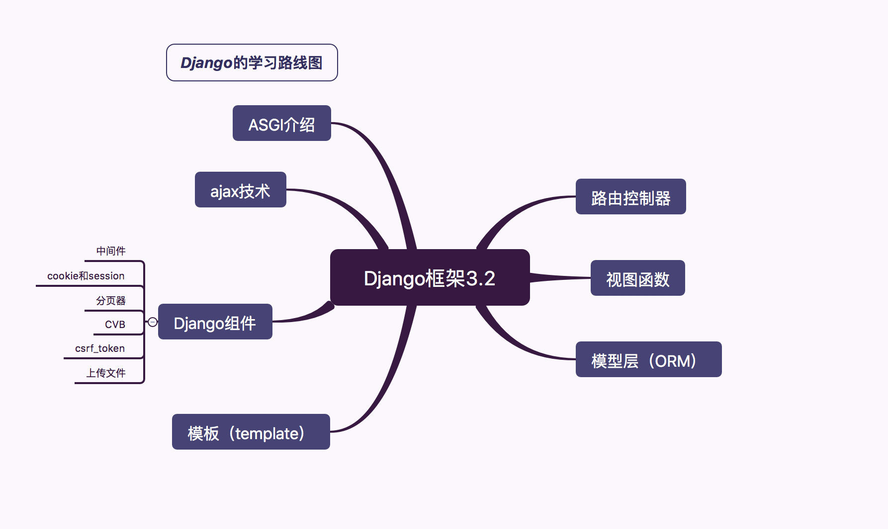

Python下有许多款不同的 Web 框架。Django是重量级选手中最有代表性的一位。许多成功的网站和APP都基于Django。Django 是一个开放源代码的 Web 应用框架，由 Python 写成。Django 遵守 BSD 版权，初次发布于 2005 年 7 月, 并于 2008 年 9 月发布了第一个正式版本 1.0 。

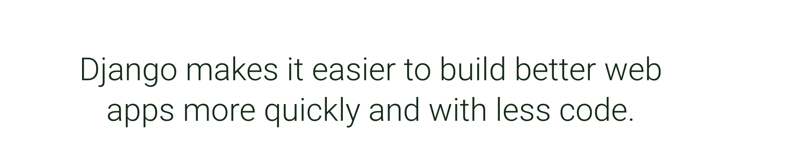

[Django文档](https://www.djangoproject.com/)

Django 采用了 MVT 的软件设计模式，即模型（Model），视图（View）和模板（Template）。

这个MVT模式并非django首创，在其他的语言里面也有类似的设计模式MVC，甚至可以说django里面的MVT事实上是借鉴了MVC模式衍生出来的。

> M，Model，模型，是用于完成操作数据库的。
>
> V，View，视图，里面的代码就是用于展示给客户端的页面效果。
>
> C，Controller，控制器，是一个类或者函数，里面的代码就是用于项目功能逻辑的，一般用于调用模型来获取数据，获取到的数据通过调用视图文件返回给客户端。

而MVT指的是：

> 1. M全拼为Model，与MVC中的M功能相同，负责和数据库交互，进行数据处理。
> 2. V全拼为View，与MVC中的C功能相同，接收请求，进行业务处理，返回应答。
> 3. T全拼为Template，与MVC中的V功能相同，负责封装构造要返回的html。

MVT模型的工作流程

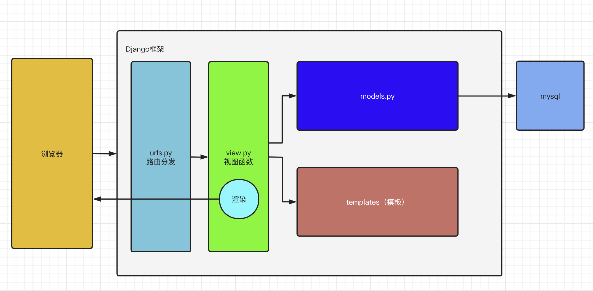

> 路由控制器将请求转发给对应的视图函数，完成业务逻辑，视图函数将从model中获取的数据嵌入到template的中模板文件（html）渲染成一个页面字符串，返回给客户端的流程。

所以我们学习Django重点是四个部分：url路由器+MVT

# 二、Django下载与运行

## 2.1、Django的下载


目前我们学习和使用的版本是3.2LTS版本

```bash
目前开源软件发布一般会有2个不同的分支版本:
1. 普通发行版本:                  经常用于一些新功能,新特性,但是维护周期短,不稳定.
2. 长线支持版本[LongTerm Supper]: 维护周期长,稳定

软件版本格式: 大版本.小版本.修订号
大版本一般是项目内容/软件的核心架构发生改动, 以前的代码已经不适用于新的版本
小版本一般是功能的删减, 删一个功能,小版本+1, 减一个功能,小版本+1
修订号一般就是原来的代码出现了bug, 会针对bug代码进行修复, 此时就会增加修订号的数值
```

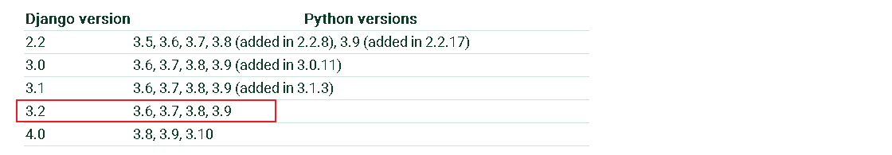

官网: `http://www.djangoproject.com`

文档:`https://docs.djangoproject.com/zh-hans/3.2/`

在本地安装

```python 
pip install django
pip install django==3.2
```

```bash
pip源:
    https://pypi.douban.com/simple/  豆瓣源
    https://pypi.tuna.tsinghua.edu.cn/simple   清华源
        
使用格式:
    pip install django -i https://pypi.douban.com/simple/
```

```bash
# 查看django版本号
django-admin --version
```

当然在以后开发或者学习中,我们肯定都会遇到在一台开发机子中,运行多个项目的情况,有时候还会出现每个项目的python解析器或者依赖包的版本有差异.

## 2.2、Django的启动运行

创建虚拟环境并在虚拟环境中下载安装django包

```bash
pip install django==3.2 -i https://pypi.douban.com/simple/
cd ~/Desktop
django-admin startproject demo
```

完成了以后,直接直接下pycharm下面的终端terminal中使用命令运行django

```bash
python manage.py runserver 8090
```

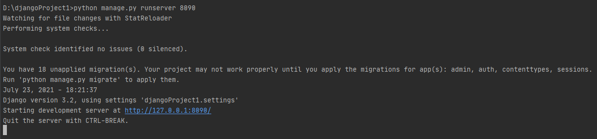

在浏览器中访问显示的地址`http://127.0.0.1:8090`.效果如下则表示正确安装了.

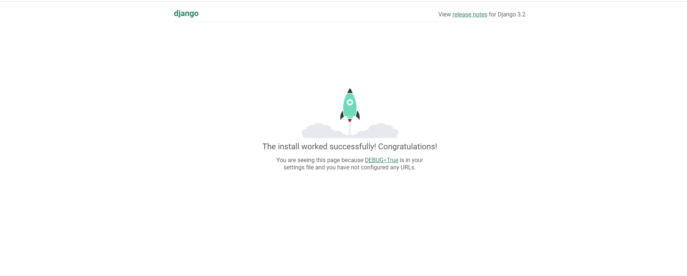

> runserver默认启动的wsgi.py文件作为web服务器接口

## 2.3、创建应用

创建自应用：

```python 
python manage.py startapp 子应用名称
```

Django完整的目录结构如下：

```bash
│─ manage.py    # 终端脚本命令,提供了一系列用于生成文件或者目录的命令,也叫脚手架
└─ dome/        # 主应用开发目录,保存了项目中的所有开发人员编写的代码, 目录是生成项目时指定的
    │- asgi.py      # django3.0以后新增的，用于让django运行在异步编程模式的一个web应用对象
    │- settings.py  # 默认开发配置文件
    │- urls.py      # 路由列表目录,用于绑定视图和url的映射关系
    │- wsgi.py      # wsgi就是项目运行在wsgi服务器时的入口文件
    └- __init__.py
└─ app01         # 子应用
    │- models    # 该应用的模型类模块
    │- views     # 该应用的视图模块
    │- tests     # 该应用的单元测试模块
    │- apps      # 该应用的一些配置，自动生成
    │- admin.py  # 该应用的后台管理系统配置
```

当然如果每次运行项目都要在终端下输入命令的话,很麻烦,这时候我们可以借助pycharm直接自动运行这段命令.当然,这个需要我们在pycharm配置一下的.

****

(小三角形)

可以在runserver 参数后配置修改django监听的端口和IP地址,当然,只能是127.0.0.1对应的其他地址.不能是任意IP.否则无法运行或访问!!

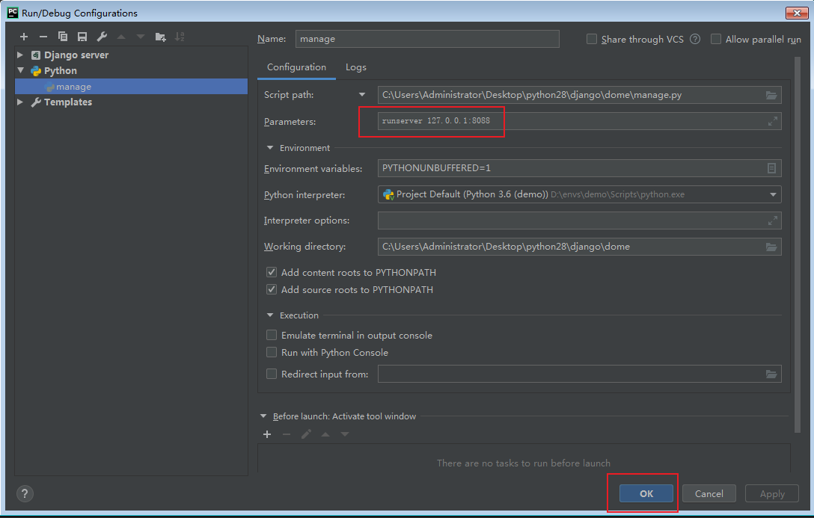


## 2.4、快速使用Django

在django中要提供数据展示给用户,我们需要完成3个步骤.

> 需求：利用Django实现一个查看当前时间的web页面。
>
> 基于MTV模型，设计步骤如下：
>
> - step1：在urls.py中设计url与视图的映射关系。
> - step2：创建子应用，在views.py中构建视图函数。
> - step3：将变量嵌入到模板中返回客户端。

#### （1）创建子应用

```bash
python manage.py startapp 子应用名称
```

> 子应用的名称将来会作为目录名而存在,所以不能出现特殊符号,不能出现中文等多字节的字符.

#### （2） 绑定路由

`demo/urls.py`代码:

```python
from django.contrib import admin
from django.urls import path
from home.views import index
urlpatterns = [
    path('admin/', admin.site.urls),
    path("timer", timer),
]

```

#### （3）视图函数

`home/view.py`,代码:

```python
from django.shortcuts import render,HttpResponse

# Create your views here.
import datetime

def timer(request):
    
    now=datetime.datetime.now().strftime("%Y-%m-%d %X")
    #return HttpResponse(now)
    return render(request,"timer.html",{"now":now})
```

#### （4）构建模板

```html
<!DOCTYPE html>
<html lang="en">
<head>
    <meta charset="UTF-8">
    <title>Title</title>

    <style>
        span{
            color: red;
        }
    </style>
</head>
<body>

<h3>当前时间：<span>{{ now }}</span></h3>

</body>
</html>
```

因为上面我们绑定index视图函数的url地址是index,所以我们可以通过`http://127.0.0.1:8000/`拼接url地址`index`来访问视图函数

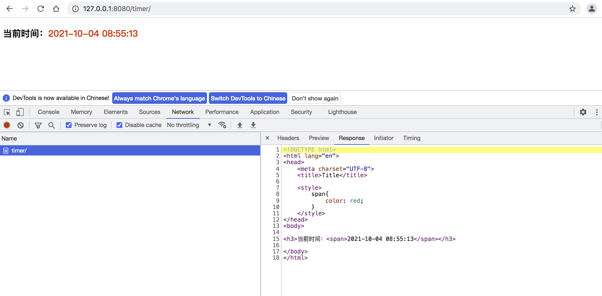

# 三、路由控制器

Route路由, 是一种映射关系！路由是把客户端请求的url路径和用户请求的应用程序[这里意指django里面的视图进行绑定映射的一种关系。

> 请求路径和视图函数不是一对一映射关系！

在django中所有的路由最终都被保存到一个变量 `urlpatterns.`, urlpatterns必须声明在主应用下的urls.py总路由中。这是由配置文件settings设置的。

在django运行中，当客户端发送了一个http请求到服务端，服务端的web服务器则会从http协议中提取url地址, 从程序内部找到项目中添加到urlpatterns里面的所有路由信息的url进行遍历匹配。如果相等或者匹配成功，则调用当前url对象的视图方法。

在给urlpatterns路由列表添加路由的过程中,django一共提供了2个函数给开发者注册路由.

```python
from django.urls import path      # 字符串路由
from django.urls import re_path   # 正则路由，会把url地址看成一个正则模式与客户端的请求url地址进行正则匹配

# path和re_path 使用参数一致.仅仅在url参数和接收参数时写法不一样
```

#### （1）基本使用

```python 
path(r'^articles/2003/$', views.special_case_2003),
re_path(r'^articles/([0-9]{4})/$', views.year_archive),
re_path(r'^articles/([0-9]{4})/([0-9]{2})/$', views.month_archive),
re_path(r'^articles/(?P<year>[0-9]{4})/(?P<month>[0-9]{2})/$', views.month_archive2),
```

#### （2）路由分发

```python 
1. Import the include() function: from django.urls import include, path
2. Add a URL to urlpatterns:  path('blog/', include('blog.urls'))
```

#### （3）路由转发器

有时候上面的内置的url转换器并不能满足我们的需求，因此django给我们提供了一个接口可以让我们自己定义自己的url转换器。

```python
from django.urls import register_converter
from django.shortcuts import HttpResponse
# 自定义路由转换器
class MobileConverter(object):
    regex = "1[3-9]\d{9}"
    def to_python(self,value):
        print(type(value))
        # 将匹配结果传递到视图内部时使用
        # 返回str还是int主要看需求,纯数字的可以返回int
        return value

    def to_url(self,value):
        # 将匹配结果用于反向解析传值时使用
        return value
    
# register_converter(路由转换器的类名,调用别名)
register_converter(MobileConverter,"mobile")
```

```python 
path("index/<mobile:mobile>",index)
```

```python 
def index(request,mobile):
    print(":::",type(mobile))
    return HttpResponse(f"hi,{mobile}用户")
```

#### （4）反向解析

在使用Django 项目时，一个常见的需求是获得URL 的最终形式，以用于嵌入到生成的内容中（视图中和显示给用户的URL等）或者用于处理服务器端的导航（重定向等）。人们强烈希望不要硬编码这些URL（费力、不可扩展且容易产生错误）或者设计一种与URLconf 毫不相关的专门的URL 生成机制，因为这样容易导致一定程度上产生过期的URL。

在需要URL 的地方，对于不同层级，Django 提供不同的工具用于URL 反查：

- 在模板中：使用url模板标签
- 在Python 代码中：使用from django.urls import reverse 函数。

urls.py中为url设置别名参数：

```python
from django.conf.urls import url
from . import views

urlpatterns = [
    #...
    url(r'^articles/([0-9]{4})/$', views.year_archive, name='news-year-archive'),
    #...
]
```

应用之在模板中反向解析:

```html
<a href="">2012 Archive</a>
<a href="/articles/2012/">2012 Archive</a>
```

应用之在py文本中反向解析:

```python
from django.shortcuts import redirect
from django.urls import reverse

def redirect_to_year(request):
    year = 2006
    reverse_path=reverse('news-year-archive', args=(year,))
    return redirect(reverse_path)  # 等效 redirect("/articles/2006/")
```

# 四、视图

django的视图主要有2种,分别是**函数视图**和**类视图**.现在刚开始学习django,我们先学习函数视图(FBV),后面再学习类视图[CBV].

## 4.1、请求方式

web项目运行在http协议下,默认肯定也支持用户通过不同的http请求发送数据来。django支持让客户端只能通过指定的Http请求来访问到项目的视图

`home/views.py`,代码:

```python
# 让用户发送POST才能访问的内容
from django.views.decorators.http import require_http_methods
@require_http_methods(["POST"])
def login(request):
    return HttpResponse("登录成功！")
```

路由绑定，`demo/urls.py`,代码:

```python
from django.contrib import admin
from django.urls import path
from home.views import index
urlpatterns = [
    path('admin/', admin.site.urls),
    path("index", index),
    path("login", login),
]
```

通过浏览器，访问效果`http://127.0.0.1:8090/login`:

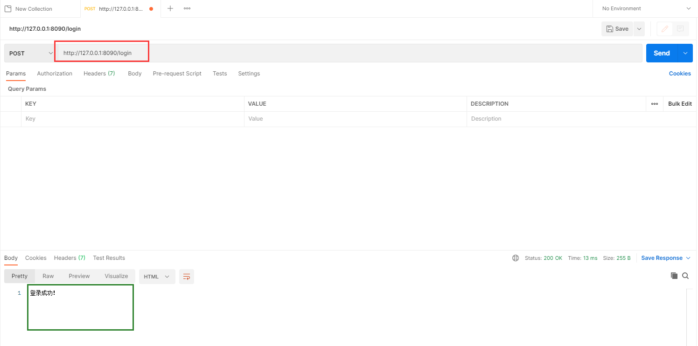

## 4.2、请求对象

django将请求报文中的请求行、首部信息、内容主体封装成 HttpRequest 类中的属性。 除了特殊说明的之外，其他均为只读的。

#### （1）请求方式

```python 
print(request.method)
```

#### （2）请求数据

```python 
# 1.HttpRequest.GET:一个类似于字典的对象，包含 HTTP GET 的所有参数。详情请参考 QueryDict 对象。

# 2.HttpRequest.POST:一个类似于字典的对象，如果请求中包含表单数据，则将这些数据封装成 QueryDict 对象。
   # 注意：键值对的值是多个的时候,比如checkbox类型的input标签，select标签，需要用：         		 request.POST.getlist("hobby")
    
# 3.HttpRequest.body:一个字符串，代表请求报文的请求体的原数据。
```

#### （3）请求路径

```python 
# HttpRequest.path:表示请求的路径组件（不含get参数）
# HttpRequest.get_full_path()：含参数路径
```

#### （4）请求头

```python 
# HttpRequest.META:一个标准的Python 字典，包含所有的HTTP 首部。具体的头部信息取决于客户端和服务器
```

## 4.3、响应对象

> 响应对象主要有三种形式：
>
> - HttpResponse()
> - render()
> - redirect()

#### （1）HttpResponse()

Django服务器接收到客户端发送过来的请求后，会将提交上来的这些数据封装成一个 HttpRequest 对象传给视图函数。那么视图函数在处理完相关的逻辑后，也需要返回一个响应给浏览器。而这个响应，我们必须返回 HttpResponseBase 或者他的子类的对象。而 HttpResponse 则是 HttpResponseBase 用得最多的子类。

常用属性： 

> 1. content：返回的内容。
> 2. status：返回的HTTP响应状态码。
> 3. content_type：返回的数据的MIME类型，默认为 text/html 。浏览器会根据这个属性，来显示数据。如果是 text/html ，那么就会解析这个字符串，如果 text/plain ，那么就会显示一个纯文本。
> 4. 设置响应头： response['X-Access-Token'] = 'xxxx' 。

JsonResponse类：

用来对象 dump 成 json 字符串，然后返回将 json 字符串封装成 Response 对象返回给浏览器。并且他的 Content-Type 是 application/json 。示例代码如下：

`````python
from django.http import JsonResponse

def index(request):
    
    return JsonResponse({"title":"三国演义","price":199})
`````

> 默认情况下 JsonResponse 只能对字典进行 dump ，如果想要对非字典的数据进行 dump ，那么需要给 JsonResponse 传递一个 safe=False 参数。示例代码如下：

#### （2）render()

```python
render(request, template_name[, context]）
#结合一个给定的模板和一个给定的上下文字典，并返回一个渲染后的 HttpResponse 对象。
```

参数：

```java
 /*
 request： 用于生成响应的请求对象。
 template_name：要使用的模板的完整名称，可选的参数
 context：添加到模板上下文的一个字典,
          默认是一个空字典。如果字典中的某个值是可调用的，视图将在渲染模板之前调用它。
          */
```

render方法就是将一个模板页面中的模板语法进行渲染，最终渲染成一个html页面作为响应体。

#### （3）redirect方法

当您使用Django框架构建Python Web应用程序时，您在某些时候必须将用户从一个URL重定向到另一个URL，

通过redirect方法实现重定向。

参数可以是:

- 一个绝对的或相对的URL, 将原封不动的作为重定向的位置.
- 一个url的别名:　可以使用reverse来反向解析url

传递要重定向到的一个具体的网址

```python
def my_view(request):
    ...
    return redirect("/some/url/")
```

当然也可以是一个完整的网址

```python
def my_view(request):
    ...
    return redirect("http://www.baidu.com")
```

传递一个视图的名称

```python
def my_view(request):
    ...
    return redirect(reverse("url的别名"))　
```

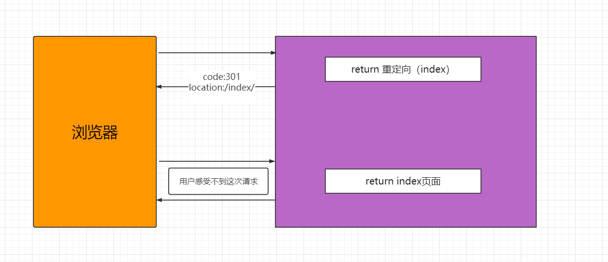

> APPEND_SLASH的实现就是基于redirect

## 4.4、登录验证案例

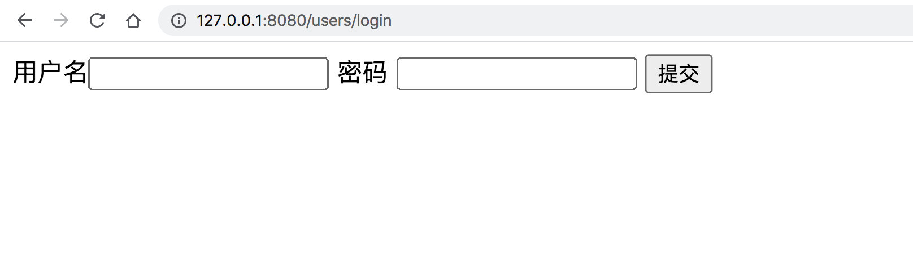

```python 
from django.contrib import admin
from django.urls import path, re_path,include

from users.views import index,login,auth
urlpatterns = [
    path("",index),
    path("login",login),
    path("auth",auth),
]


```

```python 

def login(request):

    return render(request,"users/login.html")


def auth(request):

    #  获取数据
    print("request.POST:",request.POST)

    user = request.POST.get("user")
    pwd = request.POST.get("pwd")

    # 模拟数据校验
    if user == "rain" and pwd == "123":
        # return HttpResponse("验证通过")
        return redirect("/users/")
    else:
        # return HttpResponse("用户名或者密码错误")
        # return redirect("/users/login")
        msg = "用户名或者密码错误"
        return render(request,"users/login.html",{"msg":msg})
```

```html
<!DOCTYPE html>
<html lang="en">
<head>
    <meta charset="UTF-8">
    <title>Title</title>
</head>
<body>


<form action="/users/auth" method="post">
    用户名<input type="text" name="user">
    密码 <input type="password" name="pwd">
    <input type="submit"> <span style="color: red">{{ msg }}</span>
</form>
</body>
</html>
```

# 五、模板语法

模板引擎是一种可以让开发者把服务端数据填充到html网页中完成渲染效果的技术。它实现了把前端代码和服务端代码分离的作用，让项目中的业务逻辑代码和数据表现代码分离，让前端开发者和服务端开发者可以更好的完成协同开发。

> 静态网页：页面上的数据都是写死的，万年不变
>
> 动态网页：页面上的数据是从后端动态获取的（比如后端获取当前时间；后端获取数据库数据然后传递给前端页面）

Django框架中内置了web开发领域非常出名的一个DjangoTemplate模板引擎（DTL）。[DTL官方文档](https://docs.djangoproject.com/zh-hans/3.2/topics/templates/)

要在django框架中使用模板引擎把视图中的数据更好的展示给客户端，需要完成3个步骤：

> 1.  在项目配置文件中指定保存模板文件的模板目录。一般模板目录都是设置在项目根目录或者主应用目录下。
>
> 2.  在视图中基于django提供的渲染函数绑定模板文件和需要展示的数据变量
>
> 3.  在模板目录下创建对应的模板文件，并根据模板引擎内置的模板语法，填写输出视图传递过来的数据。

配置模板目录：在当前项目根目录下创建了模板目录templates. 然后在settings.py, 模板相关配置，找到TEMPLATES配置项，填写DIRS设置模板目录。

```python
# 模板引擎配置
TEMPLATES = [
    {
        'BACKEND': 'django.template.backends.django.DjangoTemplates',
        'DIRS': [
            BASE_DIR / "templates",  # 路径拼接
        ],
        'APP_DIRS': True,
        'OPTIONS': {
            'context_processors': [
                'django.template.context_processors.debug',
                'django.template.context_processors.request',
                'django.contrib.auth.context_processors.auth',
                'django.contrib.messages.context_processors.messages',
            ],
        },
    },
]
```

## 5.1、简单案例

为了方便接下里的演示内容，我这里创建创建一个新的子应用tem

```bash
python manage.py startapp tem
```

settings.py，注册子应用，代码：

```python
INSTALLED_APPS = [
    'django.contrib.admin',
    'django.contrib.auth',
    'django.contrib.contenttypes',
    'django.contrib.sessions',
    'django.contrib.messages',
    'django.contrib.staticfiles',
    'tem',   # 开发者创建的子应用，这填写就是子应用的导包路径
]
```

总路由加载子应用路由,`urls.py`，代码：

```python
from django.contrib import admin
from django.urls import path,include
urlpatterns = [
    path('admin/', admin.site.urls),
    # path("路由前缀/", include("子应用目录名.路由模块"))
    path("users/", include("users.urls")),
    path("tem/", include("tem.urls")),
]
```

在子应用目录下创建urls.py子路由文件，代码如下：

```python
"""子应用路由"""
from django.urls import path, re_path
from . import views

urlpatterns = [
    path("index", views.index),
]
```

tem.views.index，代码：

```python
from django.shortcuts import render
def index(request):
    # 要显示到客户端的数据
	name = "hello DTL!"
    # return render(request, "模板文件路径",context={字典格式：要在客户端中展示的数据})
	return render(request, "index.html",context={"name":name})
```

templates.index.html，代码：

```html
<!DOCTYPE html>
<html lang="en">
<head>
    <meta charset="UTF-8">
    <title>Title</title>
</head>
<body>
    <h1>来自模板的内容</h1>
    <p>输出变量name的值：{{ name }}</p>
</body>
</html>
```

## 5.2、render函数内部本质


```python 
from django.shortcuts import render
from django.template.loader import get_template
from django.http.response import HttpResponse
def index(request):
	name = "hello world!"
	# 1. 初始化模板,读取模板内容,实例化模板对象
    # get_template会从项目配置中找到模板目录，我们需要填写的参数就是补全模板文件的路径
	template = get_template("index.html")
	# 2. 识别context内容, 和模板内容里面的标记[标签]替换,针对复杂的内容,进行正则的替换
	context = {"name": name}
	content = template.render(context, request) # render中完成了变量替换成变量值的过程，这个过程使用了正则。
	print(content)
	# 3. 通过response响应对象,把替换了数据的模板内容返回给客户端
	return HttpResponse(content)
	# 上面代码的简写,直接使用 django.shortcuts.render
	# return render(request, "index.html",context={"name":name})
    # return render(request,"index3.html", locals())
    # data = {}
    # data["name"] = "xiaoming"
    # data["message"] = "你好！"
    # return render(request,"index3.html", data)
```

> 1. DTL模板文件与普通html文件的区别在哪里？
>
>   DTL模板文件是一种带有特殊语法的HTML文件，这个HTML文件可以被Django编译，可以传递参数进去，实现数据动态化。在编译完成后，生成一个普通的HTML文件，然后发送给客户端。
>
> 2. 开发中，我们一般把开发中的文件分2种，分别是静态文件和动态文件。
>
> ```
> * 静态文件，数据保存在当前文件，不需要经过任何处理就可以展示出去。普通html文件，图片，视频，音频等这一类文件叫静态文件。
> * 动态文件，数据并不在当前文件，而是要经过服务端或其他程序进行编译转换才可以展示出去。 编译转换的过程往往就是使用正则或其他技术把文件内部具有特殊格式的变量转换成真实数据。 动态文件，一般数据会保存在第三方存储设备，如数据库中。django的模板文件，就属于动态文件。
> ```

## 5.3、模板语法

> 1. 变量渲染（深度查询、过滤器）
>
>    ```python
>    {{val}}
>    {{val|filter_name:参数}}
>    ```
>
> 2. 标签   
>
>    ```
>    
>    ```
>
> 3. 嵌套和继承

### 5.3.1、变量渲染之深度查询

```python 
def index(request):
    name = "root"
    age = 13
    sex = True
    lve = ["swimming", "shopping", "coding", "game"]
    bookinfo = {"id": 1, "price": 9.90, "name": "python3天入门到挣扎", }
    book_list = [
        {"id": 10, "price": 9.90, "name": "python3天入门到挣扎", },
        {"id": 11, "price": 19.90, "name": "python7天入门到垂死挣扎", },
    ]
    return render(request, 'index.html', locals())
```

模板代码，`templates/index.html`：

```html
<!DOCTYPE html>
<html lang="en">
<head>
    <meta charset="UTF-8">
    <title>Title</title>
</head>
<body>
    <p>name={{ name }}</p>
    <p>{{ age }}</p>
    <p>{{ sex }}</p>
    <p>列表成员</p>
    <p>{{ lve }}</p>
    <p>{{ lve.0 }}</p>
    <p>{{ lve | last }}</p>

    <p>字典成员</p>
    <p>id={{ bookinfo.id }}</p>
    <p>price={{ bookinfo.price }}</p>
    <p>name={{ bookinfo.name }}</p>

    <p>复杂列表</p>
    <p>{{ book_list.0.name }}</p>
    <p>{{ book_list.1.name }}</p>

</body>
</html>
```

> 通过句点符号深度查询

`tem.urls`，代码：

```python
"""子应用路由"""
from django.urls import path, re_path
from . import views

urlpatterns = [
	# ....
    path("index", views.index),
]

```

### 5.3.2、变量渲染之内置过滤器

语法：

```python 
{{obj|过滤器名称:过滤器参数}}
```

内置过滤器

| 过滤器          | 用法                                     | 代码                            |
| --------------- | ---------------------------------------- | ------------------------------- |
| last            | 获取列表/元组的最后一个成员              | {{liast \| last}}               |
| first           | 获取列表/元组的第一个成员                | {{list\|first}}                 |
| length          | 获取数据的长度                           | {{list \| length}}              |
| defualt         | 当变量没有值的情况下, 系统输出默认值,    | {{str\|default="默认值"}}       |
| safe            | 让系统不要对内容中的html代码进行实体转义 | {{htmlcontent\| safe}}          |
| upper           | 字母转换成大写                           | {{str \| upper}}                |
| lower           | 字母转换成小写                           | {{str \| lower}}                |
| title           | 每个单词首字母转换成大写                 | {{str \| title}}                |
| date            | 日期时间格式转换                         | `{{ value| date:"D d M Y" }}`   |
| cut             | 从内容中截取掉同样字符的内容             | {{content \| cut:"hello"}}      |
| list            | 把内容转换成列表格式                     | {{content \| list}}             |
| add             | 加法                                     | {{num\| add}}                   |
| filesizeformat  | 把文件大小的数值转换成单位表示           | {{filesize \| filesizeformat}}  |
| `join`          | 按指定字符拼接内容                       | {{list\| join("-")}}            |
| `random`        | 随机提取某个成员                         | {list \| random}}               |
| `slice`         | 按切片提取成员                           | {{list \| slice:":-2"}}         |
| `truncatechars` | 按字符长度截取内容                       | {{content \| truncatechars:30}} |
| `truncatewords` | 按单词长度截取内容                       | 同上                            |

过滤器的使用

```python
视图代码 home.views.py;

def index(request):
	"""过滤器 filters"""
	content = "<a href='http://www.luffycity.com'>路飞学城</a>"
	# content1 = '<script>alert(1);</script>'
	from datetime import datetime
	now = datetime.now()
	content2= "hello wrold!"
	return render(request,"index.html",locals())

# 模板代码,templates/index.html:
 
    {{ content | safe }}
    {{ content1 | safe }}

    {# 过滤器本质就是函数,但是模板语法不支持小括号调用,所以需要使用:号分割参数 #}
    <p>{{ now | date:"Y-m-d H:i:s" }}</p>
    <p>{{ conten1 | default:"默认值" }}</p>
    {# 一个数据可以连续调用多个过滤器 #}
    <p>{{ content2 | truncatechars:6 | upper }}</p>
```

### 5.3.3、自定义过滤器

虽然官方已经提供了许多内置的过滤器给开发者,但是很明显,还是会有存在不足的时候。例如:希望输出用户的手机号码时, 13912345678 ---->>  `139*****678`，这时我们就需要自定义过滤器。要声明自定义过滤器并且能在模板中正常使用,需要完成2个前置的工作:

```python 
# 1. 当前使用和声明过滤器的子应用必须在setting.py配置文件中的INSTALLED_APPS中注册了!!!
INSTALLED_APPS = [
    'django.contrib.admin',
    'django.contrib.auth',
    'django.contrib.contenttypes',
    'django.contrib.sessions',
    'django.contrib.messages',
    'django.contrib.staticfiles',
    'home',
]


# 2. 自定义过滤器函数必须被 template.register进行装饰使用.
#    而且过滤器函数所在的模块必须在templatetags包里面保存
   
# 在home子应用下创建templatetags包[必须包含__init__.py], 在包目录下创建任意py文件
# home.templatetags.my_filters.py代码:

from django import template
register = template.Library()

# 自定义过滤器
@register.filter("mobile")
def mobile(content):
	return content[:3]+"*****"+content[-3:]

# 3. 在需要使用的模板文件中顶部使用load标签加载过滤器文件my_filters.py并调用自定义过滤器
# home.views.py,代码:

def index(request):
	"""自定义过滤器 filters"""
    
	moblie_number = "13312345678"
	return render(request,"index2.html",locals())


# templates/index2.html,代码:


<!DOCTYPE html>
<html lang="en">
<head>
    <meta charset="UTF-8">
    <title>Title</title>
</head>
<body>
    {{ moblie_number| mobile }}
</body>
</html>
```

### 5.3.4、标签

#### （1）if 标签

视图代码,tem.views.py:

```python
def index(request):
    name = "xiaoming"
    age = 19
    sex = True
    lve = ["swimming", "shopping", "coding", "game"]
    user_lve = "sleep"
    bookinfo = {"id": 1, "price": 9.90, "name": "python3天入门到挣扎", }
    book_list = [
        {"id": 10, "price": 9.90, "name": "python3天入门到挣扎", },
        {"id": 11, "price": 19.90, "name": "python7天入门到垂死挣扎", },
    ]
    return render(request, 'index.html', locals())
```

模板代码,templates/index.html，代码：

```html
<!DOCTYPE html>
<html lang="en">
<head>
    <meta charset="UTF-8">
    <title>Title</title>
</head>
<body>
{# 来自django模板引擎的注释~~~~ #}

多行注释，comment中的所有内容全部都不会被显示出去


{#    #}
{#        <p>你还没成年，不能访问我的网站！</p>#}
{#    #}
{##}
{#    #}
{#        <p>超级用户，欢迎回家！</p>#}
{#    #}
{#        <p>{{ name }},你好，欢迎来到xx网站！</p>#}
{#    #}


    
        <p>那么巧，你喜欢游泳，海里也能见到你~</p>
    
        <p>那么巧，你也来收快递呀？~</p>
    
        <p>那么巧，你也在老男孩？</p>
    
        <p>看来我们没有缘分~</p>
    
</body>
</html>
```

路由代码：

```python
"""子应用路由"""
from django.urls import path, re_path
from . import views

urlpatterns = [
	# ....
    path("index", views.index),
]
```

#### （2）for标签

视图代码, home.views.py:

```python
def index7(request):
    book_list1 = [
        {"id": 11, "name": "python基础入门", "price": 130.00},
        {"id": 17, "name": "Go基础入门", "price": 230.00},
        {"id": 23, "name": "PHP基础入门", "price": 330.00},
        {"id": 44, "name": "Java基础入门", "price": 730.00},
        {"id": 51, "name": "C++基础入门", "price": 300.00},
        {"id": 56, "name": "C#基础入门", "price": 100.00},
        {"id": 57, "name": "前端基础入门", "price": 380.00},
    ]
    return render(request, 'index.html', locals())
```

template/index.html，代码：

```html
<!DOCTYPE html>
<html lang="en">
<head>
    <meta charset="UTF-8">
    <title>Title</title>
</head>
<body>
    <table width="800" align="center" border="1">
        <tr>
            <td>序号</td>
            <td>id</td>
            <td>标题</td>
            <td>价格</td>
        </tr>
        {# 多行编辑，alt+鼠标键，alt不要松开，左键点击要编辑的每一行 #}
{#        #}
{#            <tr>#}
{#                <td>{{ book.id }}</td>#}
{#                <td>{{ book.name }}</td>#}
{#                <td>{{ book.price }}</td>#}
{#            </tr>#}
{#        #}

{# 建议不要直接使用for循环一维字典，此处使用仅仅展示for嵌套for而已 #}
{#        #}
{#            <tr>#}
{#                #}
{#                <td>{{ field }} == {{ value }}</td>#}
{#                #}
{#            </tr>#}
{#        #}

{#        #}
{#            <tr>#}
{#                <td>{{ book.id }}</td>#}
{#                <td>{{ book.name }}</td>#}
{#                #}
{#                    <td bgcolor="#ff7f50">{{ book.price }}</td>#}
{#                #}
{#                    <td>{{ book.price }}</td>#}
{#                #}
{#            </tr>#}
{#        #}

        {# 逆向循环数据 #}
{#        #}
{#            <tr>#}
{#                <td>{{ book.id }}</td>#}
{#                <td>{{ book.name }}</td>#}
{#                #}
{#                    <td bgcolor="#ff7f50">{{ book.price }}</td>#}
{#                #}
{#                    <td>{{ book.price }}</td>#}
{#                #}
{#            </tr>#}
{#        #}

        
            <tr>
{#                <td>{{ forloop.counter }}</td>#}
{#                <td>{{ forloop.counter0 }}</td>#}
{#                <td>{{ forloop.revcounter }}</td>#}
{#                <td>{{ forloop.revcounter0 }}</td>#}
{#                <td>{{ forloop.first }}</td>#}
                <td>{{ forloop.last }}</td>
                <td>{{ book.id }}</td>
                <td>{{ book.name }}</td>
                
                    <td bgcolor="#ff7f50">{{ book.price }}</td>
                
                    <td>{{ book.price }}</td>
                
            </tr>
        

    </table>
</body>
</html>
```

路由代码：

```python
"""子应用路由"""
from django.urls import path, re_path
from . import views

urlpatterns = [
	# ....
    path("index", views.index),
]

```

循环中, 模板引擎提供的forloop对象,用于给开发者获取循环次数或者判断循环过程的.

| 属性                | 描述                                      |
| ------------------- | ----------------------------------------- |
| forloop.counter     | 显示循环的次数,从1开始                    |
| forloop.counter0    | 显示循环的次数,从0开始                    |
| forloop.revcounter0 | 倒数显示循环的次数,从0开始                |
| forloop.revcounter  | 倒数显示循环的次数,从1开始                |
| forloop.first       | 判断如果本次是循环的第一次,则结果为True   |
| forloop.last        | 判断如果本次是循环的最后一次,则结果为True |
| forloop.parentloop  | 在嵌套循环中，指向当前循环的上级循环      |

### 5.3.5、模板嵌套继承

传统的模板分离技术,依靠实现,这种方式,虽然达到了页面代码复用的效果,但是由此也会带来大量的碎片化模板,导致维护模板的成本上升.因此, Django框架中除了提供这种模板分离技术以外,还并行的提供了 模板继承给开发者.

````python
  # 模板嵌入
 # 模板继承 
````

#### (1)  继承父模板的公共内容

> 

视图, home.views.py代码:

```python
def index(request):
	"""模板继承"""
	return render(request,"index.html",locals())
```

子模板, templates/index.html

```html

```

父模板, templates/base.html

```html
<!DOCTYPE html>
<html lang="en">
<head>
    <meta charset="UTF-8">
    <title>Title</title>
</head>
<body>
    <h1>base.html的头部</h1>
    <h1>base.html的内容</h1>
    <h1>base.html的脚部</h1>
</body>
</html>
```

#### (2) 个性展示不同于父模板的内容

>   独立内容  
>
> {{block.super}}

视图home.views.py, 代码:

```python
def index(request):
	"""模板继承"""

	return render(request,"index.html",locals())

def home(request):
	"""模板继承"""
	return render(request,"home.html",locals())
```

路由 home.urls.py,代码:

```python
from django.urls import path
from . import views
urlpatterns = [
	path("", views.index),
	path("home/", views.home),
]
```

子模板index.html,代码:

```html

index3的标题

    {{ block.super }} {# 父级模板同名block标签的内容 #}
    <h1>index3.html的独立内容</h1>
    {{ block.super }}

```

子模板home.html,代码:

```html

home的标题
```

父模板base.html,代码:

```html
<!DOCTYPE html>
<html lang="en">
<head>
    <meta charset="UTF-8">
    <title></title>
</head>
<body>
    <h1>base.html的头部</h1>
    
    <h1>base.html的内容</h1>
    
    <h1>base.html的脚部</h1>
</body>
</html>
```

> - 如果你在模版中使用 `` 标签，它必须是模版中的第一个标签。其他的任何情况下，模版继承都将无法工作。
> - 在base模版中设置越多的 `` 标签越好。请记住，子模版不必定义全部父模版中的blocks，所以，你可以在大多数blocks中填充合理的默认内容，然后，只定义你需要的那一个。多一点钩子总比少一点好。
> - 为了更好的可读性，你也可以给你的 `` 标签一个 *名字* 。例如：`{``%` `block content``%``}``...``{``%` `endblock content``%``},`在大型模版中，这个方法帮你清楚的看到哪一个　 `` 标签被关闭了。
> - 不能在一个模版中定义多个相同名字的 `block` 标签。

## 5.4、静态文件

开发中在开启了debug模式时，django可以通过配置，允许用户通过对应的url地址访问django的静态文件。

setting.py，代码：

```python
STATIC_ROOT = BASE_DIR / 'static'
STATIC_URL = '/static/'   # django模板中，可以引用{{STATIC_URL}}变量避免把路径写死。
```

总路由，urls.py，代码：

```python
from django.views.static import serve as serve_static
urlpatterns = [
    path('admin/', admin.site.urls), 
    # 对外提供访问静态文件的路由，serve_static 是django提供静态访问支持的映射类。依靠它，客户端才能访问到django的静态文件。
    path(r'static/<path:path>', serve_static, {'document_root': settings.STATIC_ROOT},),
]
```

注意：项目上线以后，关闭debug模式时，django默认是不提供静态文件的访问支持，项目部署的时候，我们会通过收集静态文件使用nginx这种web服务器来提供静态文件的访问支持。

# 六、模型层（ORM）

Django中内嵌了ORM框架，不需要直接编写SQL语句进行数据库操作，而是通过定义模型类，操作模型类来完成对数据库中表的增删改查和创建等操作。

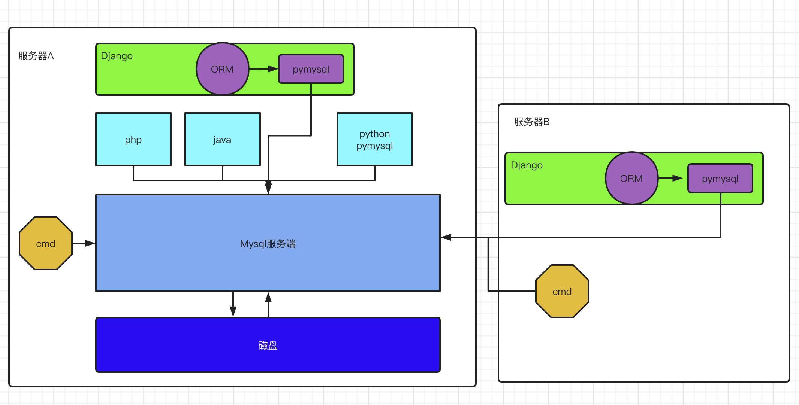

> O是object，也就**类对象**的意思。
>
> R是relation，翻译成中文是关系，也就是关系数据库中**数据表**的意思。
>
> M是mapping，是**映射**的意思。

映射：

> 类：sql语句table表
>
> 类成员变量：table表中的字段、类型和约束
>
> 类对象：sql表的表记录

ORM的优点

> - 数据模型类都在一个地方定义，更容易更新和维护，也利于重用代码。
>
> - ORM 有现成的工具，很多功能都可以自动完成，比如数据消除、预处理、事务等等。
>
> - 它迫使你使用 MVC 架构，ORM 就是天然的 Model，最终使代码更清晰。
>
> - 基于 ORM 的业务代码比较简单，代码量少，语义性好，容易理解。
>
> - 新手对于复杂业务容易写出性能不佳的 SQL,有了ORM不必编写复杂的SQL语句, 只需要通过操作模型对象即可同步修改数据表中的数据.
>
> - 开发中应用ORM将来如果要切换数据库.只需要切换ORM底层对接数据库的驱动【修改配置文件的连接地址即可】

ORM 也有缺点

> - ORM 库不是轻量级工具，需要花很多精力学习和设置，甚至不同的框架，会存在不同操作的ORM。
> - 对于复杂的业务查询，ORM表达起来比原生的SQL要更加困难和复杂。
> - ORM操作数据库的性能要比使用原生的SQL差。
> - ORM 抽象掉了数据库层，开发者无法了解底层的数据库操作，也无法定制一些特殊的 SQL。【自己使用pymysql另外操作即可，用了ORM并不表示当前项目不能使用别的数据库操作工具了。】

我们可以通过以下步骤来使用django的数据库操作

```text
1. 配置数据库连接信息
2. 在models.py中定义模型类
3. 生成数据库迁移文件并执行迁文件[注意：数据迁移是一个独立的功能，这个功能在其他web框架未必和ORM一块的]
4. 通过模型类对象提供的方法或属性完成数据表的增删改查操作
```

## 6.1、配置数据库连接

在settings.py中保存了数据库的连接配置信息，Django默认初始配置使用**sqlite**数据库。

1. 使用**MySQL**数据库首先需要安装驱动程序

   ```shell
   pip install PyMySQL
   ```

2. 在Django的工程同名子目录的`__init__`.py文件中添加如下语句

   ```python
   from pymysql import install_as_MySQLdb
   install_as_MySQLdb() # 让pymysql以MySQLDB的运行模式和Django的ORM对接运行
   ```
   
   作用是让Django的ORM能以mysqldb的方式来调用PyMySQL。
   
3. 修改**DATABASES**配置信息

   ```python
   DATABASES = {
       'default': {
           'ENGINE': 'django.db.backends.mysql',
           'HOST': '127.0.0.1',  # 数据库主机
           'PORT': 3306,  # 数据库端口
           'USER': 'root',  # 数据库用户名
           'PASSWORD': '123',  # 数据库用户密码
           'NAME': 'student'  # 数据库名字
       }
   }
   ```

4. 在MySQL中创建数据库

   ```mysql
   create database student; # mysql8.0默认就是utf8mb4;
   create database student default charset=utf8mb4; # mysql8.0之前的版本
   ```

5. 注意3: 如果想打印orm转换过程中的sql，需要在settings中进行如下配置：

   ```python
   LOGGING = {
       'version': 1,
       'disable_existing_loggers': False,
       'handlers': {
           'console':{
               'level':'DEBUG',
               'class':'logging.StreamHandler',
           },
       },
       'loggers': {
           'django.db.backends': {
               'handlers': ['console'],
               'propagate': True,
               'level':'DEBUG',
           },
       }
   }　　
   ```

## 6.2、定义模型类

定义模型类

> - 模型类被定义在"子应用/models.py"文件中。
> - 模型类必须直接或者间接继承自django.db.models.Model类。

接下来以学生管理为例进行演示。[系统大概3-4表，学生信息，课程信息，老师信息]，创建子应用student，注册子应用并引入子应用路由.

settings.py，代码：

```python
INSTALLED_APPS = [
	# ...
    'student',
]
```

urls.py，总路由代码：

```python
urlpatterns = [
    # 省略，如果前面有重复的路由，改动以下。
    path("student/", include("student.urls")),
]
```

在models.py 文件中定义模型类。

```python
from django.db import models
from datetime import datetime

# 模型类必须要直接或者间接继承于 models.Model
class BaseModel(models.Model):
	"""公共模型[公共方法和公共字段]"""
	# created_time = models.IntegerField(default=0, verbose_name="创建时间")
	created_time = models.DateTimeField(auto_now_add=True, verbose_name="创建时间")
	# auto_now_add 当数据添加时设置当前时间为默认值
	# auto_now= 当数据添加/更新时, 设置当前时间为默认值
	updated_time = models.DateTimeField(auto_now=True)
	class Meta(object):
		abstract = True # 设置当前模型为抽象模型, 当系统运行时, 不会认为这是一个数据表对应的模型.

class Student(BaseModel):
	"""Student模型类"""
	#1. 字段[数据库表字段对应]
	SEX_CHOICES = (
		(0,"女"),
		(1,"男"),
		(2,"保密"),
	)

	# 字段名 = models.数据类型(约束选项1,约束选项2, verbose_name="注释")
	# SQL: id bigint primary_key auto_increment not null comment="主键",
    # id = models.AutoField(primary_key=True, null=False, verbose_name="主键") # django会自动在创建数据表的时候生成id主键/还设置了一个调用别名 pk

    # SQL: name varchar(20) not null comment="姓名"
    # SQL: key(name),
    name = models.CharField(max_length=20, db_index=True, verbose_name="姓名" )

    # SQL: age smallint not null comment="年龄"
    age = models.SmallIntegerField(verbose_name="年龄")

    # SQL: sex tinyint not null comment="性别"
    # sex = models.BooleanField(verbose_name="性别")
    sex = models.SmallIntegerField(choices=SEX_CHOICES, default=2)

    # SQL: class varchar(5) not null comment="班级"
    # SQL: key(class)
    classmate = models.CharField(db_column="class", max_length=5, db_index=True, verbose_name="班级")
    # SQL: description longtext default "" not null comment="个性签名"
    description = models.TextField(default="", verbose_name="个性签名")

	#2. 数据表结构信息
	class Meta:
		db_table = 'tb_student'  # 指明数据库表名,如果没有指定表明,则默认为子应用目录名_模型名称,例如: users_student
		verbose_name = '学生信息表'  # 在admin站点中显示的名称
		verbose_name_plural = verbose_name  # 显示的复数名称

	#3. 自定义数据库操作方法
	def __str__(self):
		"""定义每个数据对象的显示信息"""
		return "<User %s>" % self.name
```

#### （1） 数据库表名

模型类如果未指明表名db_table，Django默认以 **小写app应用名_小写模型类名** 为数据库表名。

可通过**db_table** 指明数据库表名。

#### （2） 关于主键

django会为表创建自动增长的主键列，每个模型只能有一个主键列。

如果使用选项设置某个字段的约束属性为主键列(primary_key)后，django不会再创建自动增长的主键列。

```python
class Student(models.Model):
    # django会自动在创建数据表的时候生成id主键/还设置了一个调用别名 pk
    id = models.AutoField(primary_key=True, null=False, verbose_name="主键") # 设置主键
```

默认创建的主键列属性为id，可以使用<mark>pk</mark>代替，pk全拼为<mark>primary key</mark>。

#### （3） 属性命名限制

- 不能是python的保留关键字。

- 不允许使用连续的2个下划线，这是由django的查询方式决定的。__ 是关键字来的，不能使用！！！

- 定义属性时需要指定字段类型，通过字段类型的参数指定选项，语法如下：

  ```python
  属性名 = models.字段类型(约束选项, verbose_name="注释")
  ```

#### （4）字段类型

| 类型             | 说明                                                         |
| :--------------- | :----------------------------------------------------------- |
| AutoField        | 自动增长的IntegerField，通常不用指定，不指定时Django会自动创建属性名为id的自动增长属性 |
| BooleanField     | 布尔字段，值为True或False                                    |
| NullBooleanField | 支持Null、True、False三种值                                  |
| CharField        | 字符串，参数max_length表示最大字符个数，对应mysql中的varchar |
| TextField        | 大文本字段，一般大段文本（超过4000个字符）才使用。           |
| IntegerField     | 整数                                                         |
| DecimalField     | 十进制浮点数， 参数max_digits表示总位数， 参数decimal_places表示小数位数,常用于表示分数和价格  Decimal(max_digits=7, decimal_places=2)  ==> 99999.99~ 0.00 |
| FloatField       | 浮点数                                                       |
| DateField        | 日期<br>参数auto_now表示每次保存对象时，自动设置该字段为当前时间。<br>参数auto_now_add表示当对象第一次被创建时自动设置当前。<br>参数auto_now_add和auto_now是相互排斥的，一起使用会发生错误。 |
| TimeField        | 时间，参数同DateField                                        |
| DateTimeField    | 日期时间，参数同DateField                                    |
| FileField        | 上传文件字段,django在文件字段中内置了文件上传保存类, django可以通过模型的字段存储自动保存上传文件, 但是, 在数据库中本质上保存的仅仅是文件在项目中的存储路径!! |
| ImageField       | 继承于FileField，对上传的内容进行校验，确保是有效的图片      |

#### （5）约束选项

| 选项        | 说明                                                         |
| :---------- | ------------------------------------------------------------ |
| null        | 如果为True，表示允许为空，默认值是False。相当于python的None  |
| blank       | 如果为True，则该字段允许为空白，默认值是False。  相当于python的空字符串，“” |
| db_column   | 字段的名称，如果未指定，则使用属性的名称。                   |
| db_index    | 若值为True, 则在表中会为此字段创建索引，默认值是False。 相当于SQL语句中的key |
| default     | 默认值，当不填写数据时，使用该选项的值作为数据的默认值。     |
| primary_key | 如果为True，则该字段会成为模型的主键，默认值是False，一般不用设置，系统默认设置。 |
| unique      | 如果为True，则该字段在表中必须有唯一值，默认值是False。相当于SQL语句中的unique |

**注意：null是数据库范畴的概念，blank是表单验证范畴的**

#### （6） 外键

在设置外键时，需要通过**on_delete**选项指明主表删除数据时，对于外键引用表数据如何处理，在django.db.models中包含了可选常量：

- **CASCADE** 级联，删除主表数据时连通一起删除外键表中数据

- **PROTECT** 保护，通过抛出**ProtectedError**异常，来阻止删除主表中被外键应用的数据

- **SET_NULL** 设置为NULL，仅在该字段null=True允许为null时可用

- **SET_DEFAULT** 设置为默认值，仅在该字段设置了默认值时可用

- **SET()** 设置为特定值或者调用特定方法，例如：

  ```python
  from django.conf import settings
  from django.contrib.auth import get_user_model
  from django.db import models
  
  def get_sentinel_user():
      return get_user_model().objects.get_or_create(username='deleted')[0]
  
  class UserModel(models.Model):
      user = models.ForeignKey(
          settings.AUTH_USER_MODEL,
          on_delete=models.SET(get_sentinel_user),
      )
  ```

- **DO_NOTHING** 不做任何操作，如果数据库前置指明级联性，此选项会抛出**IntegrityError**异常

商品分类表

| id   | category |      |
| ---- | -------- | ---- |
| 1    | 蔬菜     |      |
| 2    | 电脑     |      |

商品信息表

| id   | goods_name   | cid  |
| ---- | ------------ | ---- |
| 1    | 冬瓜         | 1    |
| 2    | 华为笔记本A1 | 2    |
| 3    | 茄子         | 1    |

> 1. 当模型字段的on_delete=CASCADE, 删除蔬菜（id=1），则在外键cid=1的商品id1和3就被删除。
>
> 2. 当模型字段的on_delete=PROTECT，删除蔬菜，mysql自动检查商品信息表，有没有cid=1的记录，有则提示必须先移除掉商品信息表中，id=1的所有记录以后才能删除蔬菜。
>
> 3. 当模型字段的on_delete=SET_NULL，删除蔬菜以后，对应商品信息表，cid=1的数据的cid全部被改成cid=null
>
> 4. 当模型字段的on_delete=SET_DEFAULT，删除蔬菜以后，对应商品信息表，cid=1的数据记录的cid被被设置默认值。

## 6.3、数据迁移

将模型类定义表架构的代码转换成SQL同步到数据库中，这个过程就是数据迁移。django中的数据迁移，就是一个类，这个类提供了一系列的终端命令，帮我们完成数据迁移的工作。

#### （1）生成迁移文件

所谓的迁移文件, 是类似模型类的迁移类,主要是描述了数据表结构的类文件.

```python
python manage.py makemigrations
```

#### （2）同步到数据库中

```python
python manage.py migrate
```

补充：在django内部提供了一系列的功能，这些功能也会使用到数据库，所以在项目搭建以后第一次数据迁移的时候，会看到django项目中其他的数据表被创建了。其中就有一个django内置的admin站点管理。

```
# admin站点默认是开启状态的，我们可以通过http://127.0.0.1:8000/admin
# 这个站点必须有个管理员账号登录，所以我们可以在第一次数据迁移，有了数据表以后，就可以通过以下终端命令来创建一个超级管理员账号。
python manage.py createsuperuser
```

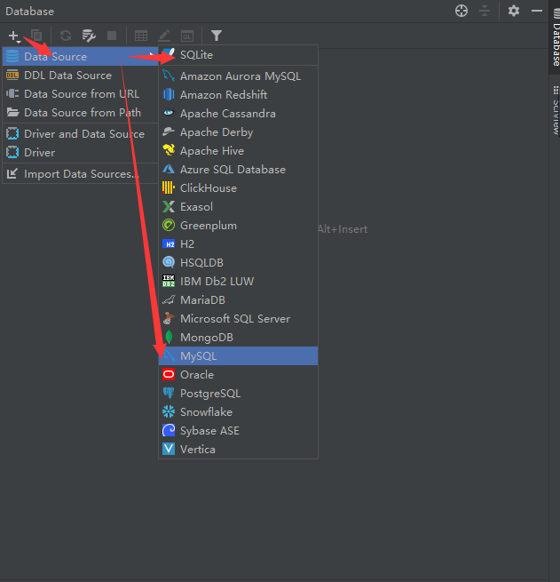

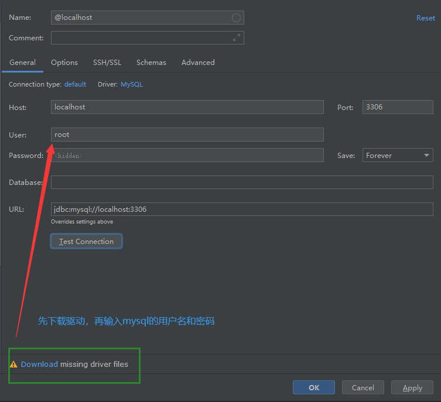

#### （3）添加测试数据

```sql
INSERT INTO `db_student`  
(`id`,`name`,`sex`,`class`,`age`,`description`,`created_time`,`updated_time`) 
VALUES
(1,'赵华',1,307,22,'对于勤奋的人来说，成功不是偶然；对于懒惰的人来说，失败却是必然。','2020-11-20 10:00:00','2020-11-20 10:00:00'),
(2,'程星云',1,301,20,'人生应该如蜡烛一样，从顶燃到底，一直都是光明的。','2020-11-20 10:00:00','2020-11-20 10:00:00'),
(3,'陈峰',1,504,21,'在不疯狂，我们就老了，没有记忆怎么祭奠呢？','2020-11-20 10:00:00','2020-11-20 10:00:00'),(4,'苏礼就',1,502,20,'不要为旧的悲伤，浪费新的眼泪。','2020-11-20 10:00:00','2020-11-20 10:00:00'),
(5,'张小玉',2,306,18,'没有血和汗水就没有成功的泪水。','2020-11-20 10:00:00','2020-11-20 10:00:00'),
(6,'吴杰',1,307,19,'以大多数人的努力程度之低，根本轮不到去拼天赋','2020-11-20 10:00:00','2020-11-20 10:00:00'),
(7,'张小辰',2,405,19,'人生的道路有成千上万条， 每一条路上都有它独自的风景。','2020-11-20 10:00:00','2020-11-20 10:00:00'),
(8,'王丹丹',2,502,22,'平凡的人听从命运，坚强的人主宰命运。','2020-11-20 10:00:00','2020-11-20 10:00:00'),
(9,'苗俊伟',1,503,22,'外事找谷歌，内事找百度。','2020-11-20 10:00:00','2020-11-20 10:00:00'),
(10,'娄镇明',1,301,22,'不经三思不求教，不动笔墨不读书。','2020-11-20 10:00:00','2020-11-20 10:00:00'),
(11,'周梦琪',2,306,19,'学习与坐禅相似，须有一颗恒心。','2020-11-20 10:00:00','2020-11-20 10:00:00'),
(12,'欧阳博',1,503,23,'春去秋来，又一年。What did you get ?','2020-11-20 10:00:00','2020-11-20 10:00:00'),
(13,'颜敏莉',2,306,20,'Knowledge makes humble, ignorance makes proud.','2020-11-20 10:00:00','2020-11-20 10:00:00'),
(14,'柳宗仁',1,301,20,'有志者事竟成。','2020-11-20 10:00:00','2020-11-20 10:00:00'),
(15,'谢海龙',1,402,22,'这世界谁也不欠谁，且行且珍惜。','2020-11-20 10:00:00','2020-11-20 10:00:00'),
(16,'邓士鹏',1,508,22,'青，取之于蓝而青于蓝；冰，水为之而寒于水。','2020-11-20 10:00:00','2020-11-20 10:00:00'),
(17,'宁静',2,502,23,'一息若存 希望不灭','2020-11-20 10:00:00','2020-11-20 10:00:00'),
(18,'上官屏儿',2,502,21,'美不自美,因人而彰。','2020-11-20 10:00:00','2020-11-20 10:00:00'),
(19,'孙晓静',2,503,20,'人生本过客，何必千千结；无所谓得失，淡看风和雨。','2020-11-20 10:00:00','2020-11-20 10:00:00'),
(20,'刘承志',1,306,20,'good good study,day day up! ^-^','2020-11-20 10:00:00','2020-11-20 10:00:00'),
(21,'王浩',1,503,21,'积土而为山，积水而为海。','2020-11-20 10:00:00','2020-11-20 10:00:00'),
(22,'钟无艳',2,303,19,'真者，精诚之至也，不精不诚，不能动人。','2020-11-20 10:00:00','2020-11-20 10:00:00'),
(23,'莫荣轩',1,409,22,'不管发生什么事，都请安静且愉快地接受人生，勇敢地、大胆地，而且永远地微笑着。','2020-11-20 10:00:00','2020-11-20 10:00:00'),
(24,'张裕民',1,303,21,'伟大的目标形成伟大的人物。','2020-11-20 10:00:00','2020-11-20 10:00:00'),
(25,'江宸轩',1,407,22,'用最少的悔恨面对过去。','2020-11-20 10:00:00','2020-11-20 10:00:00'),
(26,'谭季同',1,305,21,'人总是珍惜未得到的，而遗忘了所拥有的。','2020-11-20 10:00:00','2020-11-20 10:00:00'),
(27,'李松风',1,504,19,'明天的希望，让我们忘了今天的痛苦。','2020-11-20 10:00:00','2020-11-20 10:00:00'),
(28,'叶宗政',1,407,20,'因害怕失败而不敢放手一搏，永远不会成功。','2020-11-20 10:00:00','2020-11-20 10:00:00'),
(29,'魏雪宁',2,306,20,'成功与失败只有一纸之隔','2020-11-20 10:00:00','2020-11-20 10:00:00'),
(30,'徐秋菱',2,404,19,'年轻是我们唯一拥有权利去编织梦想的时光。','2020-11-20 10:00:00','2020-11-20 10:00:00'),
(31,'曾嘉慧',2,301,19,'有一分热，发一分光。就令萤火一般，也可以在黑暗里发一点光，不必等候炬火。','2020-11-20 10:00:00','2020-11-20 10:00:00'),
(32,'欧阳镇安',1,408,23,'青春虚度无所成，白首衔悲补何及!','2020-11-20 10:00:00','2020-11-20 10:00:00'),
(33,'周子涵',2,309,19,'青春是一个普通的名称，它是幸福美好的，但它也是充满着艰苦的磨炼。','2020-11-20 10:00:00','2020-11-20 10:00:00'),
(34,'宋应诺',2,501,23,'涓滴之水终可以磨损大石，不是由于它力量强大，而是由于昼夜不舍的滴坠。','2020-11-20 10:00:00','2020-11-20 10:00:00'),
(35,'白瀚文',1,305,19,'一个人假如不脚踏实地去做，那么所希望的一切就会落空。','2020-11-20 10:00:00','2020-11-20 10:00:00'),
(36,'陈匡怡',2,505,19,'一份耕耘，一份收获。','2020-11-20 10:00:00','2020-11-20 10:00:00'),
(37,'邵星芸',2,503,22,'冰冻三尺非一日之寒。','2020-11-20 10:00:00','2020-11-20 10:00:00'),
(38,'王天歌',2,302,21,'任何的限制，都是从自己的内心开始的。','2020-11-20 10:00:00','2020-11-20 10:00:00'),
(39,'王天龙',1,302,22,'再长的路，一步步也能走完，再短的路，不迈开双脚也无法到达。','2020-11-20 10:00:00','2020-11-20 10:00:00'),
(40,'方怡',2,509,23,'智者不做不可能的事情。','2020-11-20 10:00:00','2020-11-20 10:00:00'),
(41,'李伟',1,505,19,'人之所以能，是相信能。','2020-11-20 10:00:00','2020-11-20 10:00:00'),
(42,'李思玥',2,503,22,'人的一生可能燃烧也可能腐朽，我不能腐朽，我愿意燃烧起来。','2020-11-20 10:00:00','2020-11-20 10:00:00'),
(43,'赵思成',1,401,18,'合抱之木，生于毫末;九层之台，起于累土。','2020-11-20 10:00:00','2020-11-20 10:00:00'),
(44,'蒋小媛',2,308,22,'不积跬步无以至千里，不积细流无以成江河。','2020-11-20 10:00:00','2020-11-20 10:00:00'),
(45,'龙华',1,510,19,'只要持续地努力，不懈地奋斗，就没有征服不了的东西。','2020-11-20 10:00:00','2020-11-20 10:00:00'),
(46,'牧婧白夜',2,501,21,'读不在三更五鼓，功只怕一曝十寒。','2020-11-20 10:00:00','2020-11-20 10:00:00'),
(47,'江俊文',1,304,19,'立志不坚，终不济事。','2020-11-20 10:00:00','2020-11-20 10:00:00'),
(48,'李亚容',2,304,18,'Keep on going never give up.','2020-11-20 10:00:00','2020-11-20 10:00:00'),
(49,'王紫伊',2,301,22,'最可怕的敌人，就是没有坚强的信念。','2020-11-20 10:00:00','2020-11-20 10:00:00'),
(50,'毛小宁',1,501,19,'要从容地着手去做一件事，但一旦开始，就要坚持到底。','2020-11-20 10:00:00','2020-11-20 10:00:00'),
(51,'董 晴',2,507,19,'常常是最后一把钥匙打开了门。贵在坚持','2020-11-20 10:00:00','2020-11-20 10:00:00'),
(52,'严语',2,405,18,'逆水行舟，不进则退。','2020-11-20 10:00:00','2020-11-20 10:00:00'),
(53,'陈都灵',2,503,19,'无论什么时候，不管遇到什么情况，我绝不允许自己有一点点灰心丧气。','2020-11-20 10:00:00','2020-11-20 10:00:00'),
(54,'黄威',1,301,23,'我的字典里面没有“放弃”两个字','2020-11-20 10:00:00','2020-11-20 10:00:00'),
(55,'林佳欣',2,308,23,'梦想就是一种让你感到坚持,就是幸福的东西。','2020-11-20 10:00:00','2020-11-20 10:00:00'),
(56,'翁心颖',2,303,19,'有目标的人才能成功，因为他们知道自己的目标在哪里。','2020-11-20 10:00:00','2020-11-20 10:00:00'),
(57,'蒙毅',1,502,22,'所谓天才，就是努力的力量。','2020-11-20 10:00:00','2020-11-20 10:00:00'),
(58,'李小琳',2,509,22,'每天早上对自己微笑一下。这就是我的生活态度。','2020-11-20 10:00:00','2020-11-20 10:00:00'),
(59,'伍小龙',1,406,19,'一路上的点点滴滴才是我们的财富。','2020-11-20 10:00:00','2020-11-20 10:00:00'),
(60,'晁然',2,305,23,'人的价值是由自己决定的。','2020-11-20 10:00:00','2020-11-20 10:00:00'),
(61,'端木浩然',1,507,18,'摔倒了爬起来再哭。','2020-11-20 10:00:00','2020-11-20 10:00:00'),
(62,'姜沛佩',2,309,21,'Believe in yourself.','2020-11-20 10:00:00','2020-11-20 10:00:00'),
(63,'李栋明',1,306,19,'虽然过去不能改变，但是未来可以。','2020-11-20 10:00:00','2020-11-20 10:00:00'),
(64,'柴柳依',2,508,23,'没有实践就没有发言权。','2020-11-20 10:00:00','2020-11-20 10:00:00'),
(65,'吴杰',1,401,22,'人生有两出悲剧。一是万念俱灰;另一是踌躇满志','2020-11-20 10:00:00','2020-11-20 10:00:00'),
(66,'杜文华',1,507,19,'有智者立长志，无志者长立志。','2020-11-20 10:00:00','2020-11-20 10:00:00'),
(67,'邓珊珊',2,510,18,'Action is the proper fruit of knowledge.','2020-11-20 10:00:00','2020-11-20 10:00:00'),
(68,'杜俊峰',1,507,23,'世上无难事，只要肯登攀。','2020-11-20 10:00:00','2020-11-20 10:00:00'),
(69,'庄信杰',1,301,22,'知识就是力量。','2020-11-20 10:00:00','2020-11-20 10:00:00'),
(70,'宇文轩',1,402,23,'如果你想要某样东西，别等着有人某天会送给你。生命太短，等不得。','2020-11-20 10:00:00','2020-11-20 10:00:00'),
(71,'黄佳怿',2,510,19,'Learn and live.','2020-11-20 10:00:00','2020-11-20 10:00:00'),
(72,'卫然',1,510,18,'神于天，圣于地。','2020-11-20 10:00:00','2020-11-20 10:00:00'),
(73,'耶律齐',1,307,23,'如果不是在海市蜃楼中求胜，那就必须脚踏实地去跋涉。','2020-11-20 10:00:00','2020-11-20 10:00:00'),
(74,'白素欣',2,305,18,'欲望以提升热忱，毅力以磨平高山。','2020-11-20 10:00:00','2020-11-20 10:00:00'),
(75,'徐鸿',1,403,23,'最美的不是生如夏花，而是在时间的长河里，波澜不惊。','2020-11-20 10:00:00','2020-11-20 10:00:00'),
(76,'上官杰',1,409,19,'生活之所以耀眼，是因为磨难与辉煌会同时出现。','2020-11-20 10:00:00','2020-11-20 10:00:00'),
(77,'吴兴国',1,406,18,'生活的道路一旦选定，就要勇敢地走到底，决不回头。','2020-11-20 10:00:00','2020-11-20 10:00:00'),
(78,'庄晓敏',2,305,18,'Never say die.','2020-11-20 10:00:00','2020-11-20 10:00:00'),
(79,'吴镇升',1,509,18,'Judge not from appearances.','2020-11-20 10:00:00','2020-11-20 10:00:00'),
(80,'朱文丰',1,304,19,'每个人都比自己想象的要强大，但同时也比自己想象的要普通。','2020-11-20 10:00:00','2020-11-20 10:00:00'),
(81,'苟兴妍',2,508,18,'Experience is the best teacher.','2020-11-20 10:00:00','2020-11-20 10:00:00'),
(82,'祝华生',1,302,21,'浅学误人。','2020-11-20 10:00:00','2020-11-20 10:00:00'),
(83,'张美琪',2,404,23,'最淡的墨水，也胜过最强的记性。','2020-11-20 10:00:00','2020-11-20 10:00:00'),
(84,'周永麟',1,308,21,'All work and no play makes Jack a dull boy.','2020-11-20 10:00:00','2020-11-20 10:00:00'),
(85,'郑心',2,404,21,'人生就像一杯茶，不会苦一辈子，但总会苦一阵子。','2020-11-20 10:00:00','2020-11-20 10:00:00'),
(86,'公孙龙馨',1,510,21,'Experience is the father of wisdom and memory the mother.','2020-11-20 10:00:00','2020-11-20 10:00:00'),
(87,'叶灵珑',2,401,19,'读一书，增一智。','2020-11-20 10:00:00','2020-11-20 10:00:00'),
(88,'上官龙',1,501,21,'别人能做到的事，自己也可以做到。','2020-11-20 10:00:00','2020-11-20 10:00:00'),
(89,'颜振超',1,303,19,'如果要飞得高，就该把地平线忘掉。','2020-11-20 10:00:00','2020-11-20 10:00:00'),
(90,'玛诗琪',2,409,22,'每天进步一点点，成功不会远。','2020-11-20 10:00:00','2020-11-20 10:00:00'),
(91,'李哲生',1,309,22,'这不是偶然的失误，是必然的结果。','2020-11-20 10:00:00','2020-11-20 10:00:00'),
(92,'罗文华',2,408,22,'好走的都是下坡路。','2020-11-20 10:00:00','2020-11-20 10:00:00'),
(93,'李康',1,509,19,'Deliberate slowly, promptly.','2020-11-20 10:00:00','2020-11-20 10:00:00'),
(94,'钟华强',1,405,19,'混日子很简单,讨生活比较难。','2020-11-20 10:00:00','2020-11-20 10:00:00'),
(95,'张今菁',2,403,23,'不经一翻彻骨寒，怎得梅花扑鼻香。','2020-11-20 10:00:00','2020-11-20 10:00:00'),
(96,'黄伟麟',1,407,19,'与其诅咒黑暗，不如燃起蜡烛。没有人能给你光明，除了你自己。','2020-11-20 10:00:00','2020-11-20 10:00:00'),
(97,'程荣泰',1,406,22,'明天不一定更好,。但更好的明天一定会来。','2020-11-20 10:00:00','2020-11-20 10:00:00'),
(98,'范伟杰',1,508,19,'水至清则无鱼，人至察则无徒。凡事不能太执着。','2020-11-20 10:00:00','2020-11-20 10:00:00'),
(99,'王俊凯',1,407,21,'我欲将心向明月,奈何明月照沟渠。','2020-11-20 10:00:00','2020-11-20 10:00:00'),
(100,'白杨 ',1,406,19,'闪电从不打在相同的地方.人不该被相同的方式伤害两次。','2020-11-20 10:00:00','2020-11-20 10:00:00');
```

```sql 
-- 作业：
-- 1. 完成学生的创建，导入上面的数据。
-- 2. 使用原来学过的SQL语句，然后对上面导入的学生信息，完成增删查改的操作。
   -- 2.0 查询所有的学生信息（name，age）
       SELECT name,age FROM db_student
   -- 2.1 查询年龄在18-20之间的学生信息[name,age,sex]
       select name,age,sex from db_student where age >=18 and age <=20;
   -- 2.2 查询年龄在18-20之间的男生信息[name,age,sex]
       select name,age,if(sex=1,'男','女') as sex from db_student where age >=18 and age <=20 and sex=1;
   -- 2.3 查询401-406之间所有班级的学生信息[name,age,sex,class]
       select name,age,sex,class from db_student where class between 401 and 406;
   -- 2.4 查询401-406之间所有班级的总人数
       select count(1) as c from db_student where class between 401 and 406;
   -- 2.5 添加一个学生，男，刘德华，302班，17岁，"给我一杯水就行了。",'2020-11-20 10:00:00','2020-11-20 10:00:00'
       insert into db_student (name,sex,class, age, description, created_time,updated_time) values ('刘德华',1,'302', 17, "给我一杯水就行了。",'2020-11-20 10:00:00','2020-11-20 10:00:00');
   -- 2.6 修改刘德华的年龄，为19岁。
       update db_student set age=19 where name='刘德华';
   -- 2.7 刘德华毕业了，把他从学生表中删除
       delete  from db_student where name='刘德华';
   -- 2.8 找到所有学生中，年龄最小的5位同学和年龄最大的5位同学
       select * from db_student order by age asc limit 5;
       select * from db_student order by age desc limit 5;
   -- 2.9 【进阶】找到所有班级中人数超过4个人班级出来
       select class,count(id) as total from db_student group by class having total >= 4;
   -- 2.10【进阶】把上面2.8的要求重新做一遍，改成一条数据实现
       (select * from db_student order by age asc limit 5) union all (select * from db_student order by age desc limit 5);
```

## 6.4、数据库基本操作

### 6.4.1、添加记录

#### （1）save方法

通过创建模型类对象，执行对象的save()方法保存到数据库中。

```python
student = Student(
    name="刘德华",
    age=17,
    sex=True,
    clasmate=301,
    description="一手忘情水"
)
student.save()
print(student.id) # 判断是否新增有ID
```

#### （2）create方法

通过模型类.objects.create()保存，返回生成的模型类对象。

```python
student = Student.objects.create(
    name="赵本山",
    age=50,
    sex=True,
    class_number=301,
    description="一段小品"
)
print(student.id)
```

### 6.4.2、基础查询

ORM中针对查询结果的限制,提供了一个查询集[QuerySet].这个QuerySet,是ORM中针对查询结果进行保存数据的一个类型,我们可以通过了解这个QuerySet进行使用,达到查询优化,或者限制查询结果数量的作用。

#### （1）all()

查询所有对象，返回queryset对象。查询集，也称查询结果集、QuerySet，表示从数据库中获取的对象集合。

```python
students = Student.objects.all()
print("students:",students)
```

#### （2）filter()

筛选条件相匹配的对象，返回queryset对象。

```python
# 查询所有的女生
students = Student.objects.filter(sex=0)
print(students)
```

#### （3）get()

返回与所给筛选条件相匹配的对象，返回结果有且只有一个， 如果符合筛选条件的对象超过一个或者没有都会抛出错误。

```python 

student = Student.objects.get(pk=1)
print(student)
print(student.description)
get使用过程中的注意点：get是根据条件返回多个结果或者没有结果，都会报错
try:
    student = Student.objects.get(name="刘德华")
    print(student)
    print(student.description)
except Student.MultipleObjectsReturned:
    print("查询得到多个结果！")
except Student.DoesNotExist:
    print("查询结果不存在！")
```

#### （4）first()、last()

分别为查询集的第一条记录和最后一条记录

```python 
# 没有结果返回none，如果有多个结果，则返回模型对象
students = Student.objects.all()
# print(students.name)
print(students[0].name)
stu01 = Student.objects.first()
stu02 = Student.objects.last()

print(stu01.name)
print(stu02.name)
```

#### （5）exclude()

筛选条件不匹配的对象，返回queryset对象。

```python
# 查询张三以外的所有的学生
students = Student.objects.exclude(name="张三")
print(students)
```

#### （6）order_by()

对查询结果排序

```python 
# order_by("字段")  # 按指定字段正序显示，相当于 asc  从小到大
# order_by("-字段") # 按字段倒序排列，相当于 desc 从大到小
# order_by("第一排序","第二排序",...)

# 查询所有的男学生按年龄从高到低展示
# students = Student.objects.all().order_by("-age","-id")
students = Student.objects.filter(sex=1).order_by("-age", "-id")
print(students)
```

#### （7）count()

查询集中对象的个数

```python 
# 查询所有男生的个数
count = Student.objects.filter(sex=1).count()
print(count)
```

#### （8）exists()

判断查询集中是否有数据，如果有则返回True，没有则返回False

````python
# 查询Student表中是否存在学生
print(Student.objects.exists())
````

#### （9）values()、values_list()

* `value()`把结果集中的模型对象转换成**字典**,并可以设置转换的字段列表，达到减少内存损耗，提高性能

* `values_list()`: 把结果集中的模型对象转换成**列表**，并可以设置转换的字段列表（元祖），达到减少内存损耗，提高性能

```python 
# values 把查询结果中模型对象转换成字典
student_list = Student.objects.filter(classmate="301")
student_list = student_list.order_by("-age")
student_list = student_list.filter(sex=1)
ret1 = student_list.values() # 默认把所有字段全部转换并返回
ret2 = student_list.values("id","name","age") # 可以通过参数设置要转换的字段并返回
ret3 = student_list.values_list() # 默认把所有字段全部转换并返回
ret4 = student_list.values_list("id","name","age") # 可以通过参数设置要转换的字段并返回
print(ret4)
return JsonResponse({},safe=False)
```

#### （10）distinct()

从返回结果中剔除重复纪录。返回queryset。

````python
# 查询所有学生出现过的年龄
print(Student.objects.values("age").distinct())
````

### 6.4.3、模糊查询

#### （1）模糊查询之contains

> 说明：如果要包含%无需转义，直接写即可。

例：查询姓名包含'华'的学生。

```python
Student.objects.filter(name__contains='华')
```

#### （2）模糊查询之startswith、endswith

例：查询姓名以'文'结尾的学生

```python
Student.objects.filter(name__endswith='文')
```

> 以上运算符都区分大小写，在这些运算符前加上i表示不区分大小写，如iexact、icontains、istartswith、iendswith.

#### （3）模糊查询之isnull

例：查询个性签名不为空的学生。

```python
# 修改Student模型description属性允许设置为null，然后数据迁移
description = models.TextField(default=None, null=True, verbose_name="个性签名")
# 添加测试数据
NSERT INTO student.db_student (name, age, sex, class, description, created_time, updated_time) VALUES ('刘德华', 17, 1, '407', null, '2020-11-20 10:00:00.000000', '2020-11-20 10:00:00.000000');
# 代码操作
tudent_list = Student.objects.filter(description__isnull=True)
```

#### （4）模糊查询之in

例：查询编号为1或3或5的学生

```python
Student.objects.filter(id__in=[1, 3, 5])
```

#### （5）模糊查询之比较查询

- **gt** 大于 (greater then)
- **gte** 大于等于 (greater then equal)
- **lt** 小于 (less then)
- **lte** 小于等于 (less then equal)

例：查询编号大于3的学生

```python
Student.objects.filter(id__gt=3)
```

#### （6）模糊查询之日期查询

**year、month、day、week_day、hour、minute、second：对日期时间类型的属性进行运算。**

例：查询2010年被添加到数据中的学生。

```python
Student.objects.filter(born_date__year=1980)
```

例：查询2016年6月20日后添加的学生信息。

```python
from django.utils import timezone as datetime
student_list = Student.objects.filter(created_time__gte=datetime.datetime(2016,6,20),created_time__lt=datetime.datetime(2016,6,21)).all()
print(student_list)
```

### 6.4.4、进阶查询

#### （1） F查询

之前的查询都是对象的属性与常量值比较，两个属性怎么比较呢？ 答：使用F对象，被定义在django.db.models中。

语法如下：

```sql
"""F对象：2个字段的值比较"""
# 获取从添加数据以后被改动过数据的学生
from django.db.models import F
# SQL: select * from db_student where created_time=updated_time;
student_list = Student.objects.exclude(created_time=F("updated_time"))
print(student_list)
```

#### （2） Q查询

**多个过滤器逐个调用表示逻辑与关系，同sql语句中where部分的and关键字。**

例：查询年龄大于20，并且编号小于30的学生。

```python
Student.objects.filter(age__gt=20,id__lt=30)
或
Student.filter(age__gt=20).filter(id__lt=30)
```

**如果需要实现逻辑或or的查询，需要使用Q()对象结合|运算符**，Q对象被义在django.db.models中。

语法如下：

```text
Q(属性名__运算符=值)
Q(属性名__运算符=值) | Q(属性名__运算符=值)
```

例：查询年龄小于19或者大于20的学生，使用Q对象如下。

```python
from django.db.models import Q
student_list = Student.objects.filter( Q(age__lt=19) | Q(age__gt=20) ).all()
```

**Q对象可以使用&、|连接，&表示逻辑与，|表示逻辑或****

例：查询年龄大于20，或编号小于30的学生，只能使用Q对象实现

```python
Student.objects.filter(Q(age__gt=20) | Q(pk__lt=30))
```

`Q对象左边可以使用~操作符，表示非not。但是工作中，我们只会使用Q对象进行或者的操作，只有多种嵌套复杂的查询条件才会使用&和~进行与和非得操作`。

例：查询编号不等于30的学生。

```python
Student.objects.filter(~Q(pk=30))
```

#### （3）聚合查询

使用aggregate()过滤器调用聚合函数。聚合函数包括：**Avg** 平均，**Count** 数量，**Max** 最大，**Min** 最小，**Sum** 求和，被定义在django.db.models中。

例：查询学生的平均年龄。

```python
from django.db.models import Sum,Count,Avg,Max,Min

Student.objects.aggregate(Avg('age'))
```

注意：aggregate的返回值是一个字典类型，格式如下：

```python
  {'属性名__聚合类小写':值}
```

使用count时一般不使用aggregate()过滤器。

例：查询学生总数。

```python
Student.objects.count() # count函数的返回值是一个数字。
```

#### （4）分组查询

```python
QuerySet对象.annotate()
# annotate() 进行分组统计，按前面select 的字段进行 group by
# annotate() 返回值依然是 queryset对象，增加了分组统计后的键值对
模型对象.objects.values("id").annotate(course=Count('course__sid')).values('id','course')
# 查询指定模型， 按id分组 , 将course下的sid字段计数，返回结果是 name字段 和 course计数结果 

# SQL原生语句中分组之后可以使用having过滤，在django中并没有提供having对应的方法，但是可以使用filter对分组结果进行过滤
# 所以filter在annotate之前，表示where，在annotate之后代表having
# 同理，values在annotate之前，代表分组的字段，在annotate之后代表数据查询结果返回的字段
```

#### （5）原生查询

执行原生SQL语句,也可以直接跳过模型,才通用原生pymysql.

```python
 ret = Student.objects.raw("SELECT id,name,age FROM db_student")  # student 可以是任意一个模型
 # 这样执行获取的结果无法通过QuerySet进行操作读取,只能循环提取
 print(ret,type(ret))
 for item in ret:
    print(item,type(item))
```

### 6.4.5、修改记录

#### （1） 使用save更新数据

```python 
student = Student.objects.filter(name='刘德华').first()
print(student)
student.age = 19
student.classmate = "303"
# save之所以能提供给我们添加数据的同时，还可以更新数据的原因？
# save会找到模型的字段的主键id的值，
# 主键id的值如果是none，则表示当前数据没有被数据库，所以save会自动变成添加操作
# 主键id有值，则表示当前数据在数据库中已经存在，所以save会自动变成更新数据操作
student.save()
```

#### （2）update更新（推荐）

**使用模型类.objects.filter().update()**，会返回受影响的行数

```python
# update是全局更新，只要符合更新的条件，则全部更新，因此强烈建议加上条件！！！
student = Student.objects.filter(name="赵华",age=22).update(name="刘芙蓉",sex=True)
print(student)
```

### 6.4.6、删除记录

删除有两种方法

#### （1）模型类对象.delete

```python
student = Student.objects.get(id=13)
student.delete()
```

#### （2）模型类.objects.filter().delete()

```python
Student.objects.filter(id=14).delete() 
```

代码：

```python
# 1. 先查询到数据模型对象。通过模型对象进行删除
# student = Student.objects.filter(pk=13).first()
# student.delete()

# 2. 直接删除
ret = Student.objects.filter(pk=100).delete()
print(ret)
# 务必写上条件，否则变成了清空表了。ret = Student.objects.filter().delete()
```

## 6.5、创建关联模型

````sql

-- 版本1
-- student
id  name  age class_name  class_tutor  class_num
1   rain  22  s12         zhangsan     78 
2   alvin 24  s12         zhangsan     78 
3   eric  23  s12         zhangsan     78 


-- 版本2: 一对多是通过在多的表中创建关联字段
-- student
id  name  age  class_id  
1   rain  22      1 
2   alvin 24      1 
3   eric  23      1  


-- class
id  class_name  class_tutor  class_num
1    s12         zhangsan     78 
2    s13         lisi         88

-- 查询学生rain所在班级名称
select class_id from student where name = 'rain'  -- 1
select class_name from class where id = 1


-- 多对多的关系的确立是通过创建第三张关系表来完成的

-- course（选秀课程）
 id  name  
 
 1   python
 2   java
 3   php
 
 
 -- student2course
 
 id  student_id  course_id
  1      1          1      -- id为1的学生选修了id为1的课程
  2      1          2      -- id为1的学生选修了id为2的课程
  3      2          2      -- id为2的学生选修了id为2的课程
 

-- 一对一 ，类似一对多，在两张关系表中的任何一张都可以建立一个关联字段
-- student
id  name  age  class_id  student_detail_id(unique)  
1   rain  22      1            1
2   alvin 24      1            3 
3   eric  23      1            2


-- student_detail
id  addr   email   tel   
1   bj     123     110 
2   bj     234     911
3   nj     456     112


````

实例：我们来假定下面这些概念，字段和关系

> - 班级模型: 班级名称、导员。
> - 课程模型：课程名称、讲师等。
> - 学生模型： 学生有姓名，年龄，只有一个班级，所以和班级表是一对多的关系(one-to-many);选修了多个课程，所以和课程表是多对多的关系(many-to-many)
> - 学生详情：学生的家庭地址，手机号，邮箱等详细信息，和学生模型应该是一对一的关系（one-to-one）

模型建立如下：

```python 
from django.db import models


# Create your models here.


class Clas(models.Model):
    name = models.CharField(max_length=32, unique=True, verbose_name="班级名称")

    class Meta:
        db_table = "db_class"


class Course(models.Model):
    name = models.CharField(max_length=32, unique=True, verbose_name="课程名称")

    class Meta:
        db_table = "db_course"


class Student(models.Model):
    sex_choices = (
        (0, "女"),
        (1, "男"),
        (2, "保密"),
    )

    name = models.CharField(max_length=32, unique=True, verbose_name="姓名")
    age = models.SmallIntegerField(verbose_name="年龄", default=18)  # 年龄
    sex = models.SmallIntegerField(choices=sex_choices)
    birthday = models.DateField()

    # 一对多
    # on_delete= 关联关系的设置
    # models.CASCADE    删除主键以后, 对应的外键所在数据也被删除
    # models.DO_NOTHING 删除主键以后, 对应的外键不做任何修改
    # 反向查找字段 related_name
    clas = models.ForeignKey("Clas", on_delete=models.CASCADE)

    # 多对多
    # 建立多对多的关系,ManyToManyField可以建在两个模型中的任意一个，自动创建第三张表
    courses = models.ManyToManyField("Course", db_table="db_student2course")

    # 一对一,使用同一对多
    stu_detail = models.OneToOneField("StudentDetail", on_delete=models.CASCADE)

    class Meta:
        db_table = "db_student"

    def __str__(self):
        return self.name


class StudentDetail(models.Model):
    tel = models.CharField(max_length=32)
    email = models.EmailField()
    description = models.TextField(null=True, verbose_name="个性签名")

    class Meta:
        db_table = "db_student_detail"

```

## 6.6、关联添加

#### （1）一对多与一对一

```python 
 stu = Student.objects.create(name="王五", age=23, sex=1, birthday="1991-11-12", clas_id=9, stu_detail_id=6)
  print(stu.name)
  print(stu.age)
  print(stu.sex)
  print(stu.clas_id)  # 6
  print(stu.stu_detail_id)  # 5
  print(stu.clas)  # 模型类对象
  print(stu.stu_detail)  # 模型类对象

  # 查询stu这个学生的班级名称
  print(stu.clas.name)
  # 查询stu这个学生的手机号
  print(stu.stu_detail.tel)
```

#### （2）多对多

```python 
 # stu = Student.objects.create(name="rain", age=33, sex=1, birthday="1996-11-12", clas_id=9, stu_detail_id=7)

    # (1) 添加多对多的数据

    # 添加多对多方式1
    c1 = Course.objects.get(title="思修")
    c2 = Course.objects.get(title="逻辑学")
    stu.courses.add(c1,c2)

    # 添加多对多方式2
    stu = Student.objects.get(name="张三")
    stu.courses.add(5,7)

    # 添加多对多方式3
    stu = Student.objects.get(name="李四")
    stu.courses.add(*[6,7])

    # (2) 删除多对多记录

   stu = Student.objects.get(name="李四")
   stu.courses.remove(7)

    # (3) 清空多对多记录：clear方法

    stu = Student.objects.get(name="rain")
    stu.courses.clear()

    # (4) 重置多对多记录：set方法

    stu = Student.objects.get(name="李四")
    stu.courses.set([5,8])

    # (5) 多对多记录查询： all
    # 查询李四所报课程的名称
    stu = Student.objects.get(name="李四")
    courses = stu.courses.all()
    courses = stu.courses.all().values("title")
    print(courses)  # <QuerySet [<Course: Course object (5)>, <Course: Course object (8)>]>

```

## 6.7、关联查询

#### 6.7.1、基于对象查询（子查询）

```python 
    # **********************************  一对多查询
    # 查询张三所在班级的名称
    # stu = Student.objects.get(name="张三")
    # print(stu.clas.name)

    # 查询计算机科学与技术2班有哪些学生

    # clas = Clas.objects.get(name="计算机科学与技术2班")
    # 反向查询方式1：
    # ret = clas.student_set.all()  # 反向查询按表名小写_set
    # print(ret) # <QuerySet [<Student: 张三>, <Student: 李四>]>
    # 反向查询方2：

    # print(clas.student_list.all())  # <QuerySet [<Student: 张三>, <Student: 李四>]>

    # **********************************  一对一查询

    # 查询李四的手机号
    # stu = Student.objects.get(name="李四")
    # print(stu.stu_detail.tel)

    # 查询110手机号的学生姓名和年龄

    # stu_detail = StudentDetail.objects.get(tel="110")
    # 反向查询方式1： 表名小写
    # print(stu_detail.student.name)
    # print(stu_detail.student.age)
    # 反向查询方式2： related_name
    # print(stu_detail.stu.name)
    # print(stu_detail.stu.age)

    # **********************************  多对多查询

    # 查询张三所报课程的名称

    # stu = Student.objects.get(name="张三")
    # print(stu.courses.all())  # QuerySet [<Course: 近代史>, <Course: 篮球>]>

    # 查询选修了近代史这门课程学生的姓名和年龄
    # course = Course.objects.get(title="近代史")
    # 反向查询方式1： 表名小写_set
    # print(course.student_set.all()) # <QuerySet [<Student: 张三>, <Student: 李四>]>

    # 反向查询方式2：related_name
    # print(course.students.all())
    # print(course.students.all().values("name","age")) # <QuerySet [{'name': '张三', 'age': 22}, {'name': '李四', 'age': 24}]>

```

> （1）正向查询按字段
>
> （2）反向查询按表名小写或者related_name

#### 6.7.2、基于双下划线查询（join查询）

```python 

    # 查询张三的年龄
    ret = Student.objects.filter(name="张三").values("age")
    print(ret) # <QuerySet [{'age': 22}]>

    # (1) 查询年龄大于22的学生的姓名以及所在名称班级
    # select db_student.name,db_class.name from db_student inner join db_class on db_student.clas_id = db_class.id where db_student.age>22;

    # 方式1 ： Student作为基表
    ret = Student.objects.filter(age__gt=22).values("name","clas__name")
    print(ret)
    # 方式2 ：Clas表作为基表
    ret = Clas.objects.filter(student_list__age__gt=22).values("student_list__name","name")
    print(ret)

    # (2) 查询计算机科学与技术2班有哪些学生

    ret = Clas.objects.filter(name="计算机科学与技术2班").values("student_list__name")
    print(ret)  #<QuerySet [{'student_list__name': '张三'}, {'student_list__name': '李四'}]>

    # (3) 查询张三所报课程的名称

    ret = Student.objects.filter(name="张三").values("courses__title")
    print(ret) # <QuerySet [{'courses__title': '近代史'}, {'courses__title': '篮球'}]>

    # (4) 查询选修了近代史这门课程学生的姓名和年龄

    ret = Course.objects.filter(title="近代史").values("students__name","students__age")
    print(ret) # <QuerySet [{'students__name': '张三', 'students__age': 22}, {'students__name': '李四', 'students__age': 24}]>

    # (5) 查询李四的手机号

    ret = Student.objects.filter(name='李四').values("stu_detail__tel")
    print(ret)  # <QuerySet [{'stu_detail__tel': '911'}]>


    # (6) 查询手机号是110的学生的姓名和所在班级名称

    # 方式1
    ret = StudentDetail.objects.filter(tel="110").values("stu__name","stu__clas__name")
    print(ret) # <QuerySet [{'stu__name': '张三', 'stu__clas__name': '计算机科学与技术2班'}]>

    # 方式2：
    ret = Student.objects.filter(stu_detail__tel="110").values("name","clas__name")
    print(ret) # <QuerySet [{'name': '张三', 'clas__name': '计算机科学与技术2班'}]>

```

> （1）正向关联按关联字段
>
> （2）反向按表名小写或related_name

#### 6.7.3、关联分组查询

````python 
# from django.db.models import Avg, Count, Max, Min
ret = Student.objects.values("sex").annotate(c = Count("name"))
print(ret) # <QuerySet [{'sex': 0, 'c': 1}, {'sex': 1, 'c': 3}]>

# （1）查询每一个班级的名称以及学生个数

ret = Clas.objects.values("name").annotate(c = Count("student_list__name"))
print(ret) # <QuerySet [{'name': '网络工程1班', 'c': 0}, {'name': '网络工程2班', 'c': 0}, {'name': '计算机科学与技术1班', 'c': 0}, {'name': '计算机科学与技术2班', 'c': 1}, {'name': '软件1班', 'c': 3}]>

# （2）查询每一个学生的姓名,年龄以及选修课程的个数

ret = Student.objects.values("name","age").annotate(c=Count("courses__title"))
print(ret) # <QuerySet [{'name': 'rain', 'c': 0}, {'name': '张三', 'c': 2}, {'name': '李四', 'c': 2}, {'name': '王五', 'c': 0}]>

ret = Student.objects.all().annotate(c=Count("courses__title")).values("name","age","sex","c")
# print(ret)

# (3) 每一个课程名称以及选修学生的个数
ret = Course.objects.all().annotate(c = Count("students__name")).values("title","c")
print(ret) # <QuerySet [{'title': '近代史', 'c': 2}, {'title': '思修', 'c': 0}, {'title': '篮球', 'c': 1}, {'title': '逻辑学', 'c': 1}, {'title': '轮滑', 'c': 0}]>

# (4)  查询选修课程个数大于1的学生姓名以及选修课程个数
ret = Student.objects.all().annotate(c=Count("courses__title")).filter(c__gt=1).values("name","c")
print(ret) # <QuerySet [{'name': '张三', 'c': 2}, {'name': '李四', 'c': 2}]>

# (5) 查询每一个学生的姓名以及选修课程个数并按着选修的课程个数进行从低到高排序
ret = Student.objects.all().annotate(c=Count("courses__title")).order_by("c").values("name","c")
print(ret)
````

## 6.8、项目练习


# 七、Ajax请求

客户端（浏览器）向服务端发起请求的形式：

1. 地址栏：GET
2. 超链接标签：GET
3. form表单：GET或POST
4. Ajax（重要）：GET或POST或PUT或DELETE

AJAX（Asynchronous Javascript And XML）翻译成中文就是“异步Javascript和XML”。即使用Javascript语言与服务器进行异步交互，传输的数据为XML（当然，传输的数据不只是XML,现在更多使用json数据）。

AJAX的特点和优点：

- 异步
- 局部刷新

应用：


## 7.2、json数据

```python 
'''
Supports the following objects and types by default:

    +-------------------+---------------+
    | Python            | JSON          |
    +===================+===============+
    | dict              | object        |
    +-------------------+---------------+
    | list, tuple       | array         |
    +-------------------+---------------+
    | str               | string        |
    +-------------------+---------------+
    | int, float        | number        |
    +-------------------+---------------+
    | True              | true          |
    +-------------------+---------------+
    | False             | false         |
    +-------------------+---------------+
    | None              | null          |
    +-------------------+---------------+

'''
```

#### （1）python的序列化和反序列化方法

```python 
import json

dic = {"name": "yuan"}
dic_json = json.dumps(dic)
dic = json.dumps(dic_json)
```

#### （2）Django支持的序列化方法

关于Django中的序列化主要应用在将数据库中检索的数据返回给客户端用户，特别的Ajax请求一般返回的为Json格式。

```python 
# 序列化响应类
from django.http import JsonResponse
JsonResponse({})
# 序列化queryset
from django.core import serializers
ret = models.Book.objects.all()
data = serializers.serialize("json", ret)
```

## 7.3、Ajax请求案例


#### (1) 视图

```python 
# Create your views here.
def reg(request):
    return render(request, "reg.html")

def reg_user(request):
    data = {"msg": "", "state": "success"}
    user = request.POST.get("user")
    if user == "yuan":
        data["state"] = "error"
        data["msg"] = "该用户已存在！"

    return JsonResponse(data)
```

#### (2) 模板：reg.html

```html 
<!DOCTYPE html>
<html lang="en">
<head>
    <meta charset="UTF-8">
    <title>Title</title>
</head>
<body>

<p>用户名：<input type="text"><span class="error" style="color: red"></span></p>

<script src="https://cdn.bootcdn.net/ajax/libs/jquery/3.6.0/jquery.js"></script>
<script>

    $(":text").blur(function () {
        // 发送Ajax请求
        $.ajax({
            url: "http://127.0.0.1:8008/reg_user/",
            type: "post",
            data: {
                user: $(":text").val(),
            },
            success: function (response) {
                console.log(response);
                $(".error").html(response.msg);
            }
        })
    })

</script>

</body>
</html>
```

#### (3) 流程图

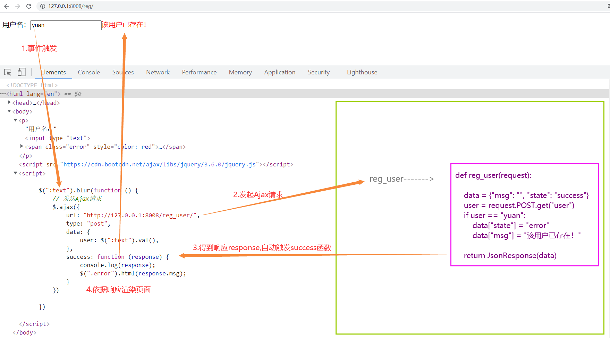

练习：

1. 计算器
2. ajxa通过orm获取书籍并展示

## 7.4、同源策略

### 7.4.1、同源策略和跨域

现在我们将reg.html单独放在客户端，用浏览器打开，再触发事件，会发现报错：

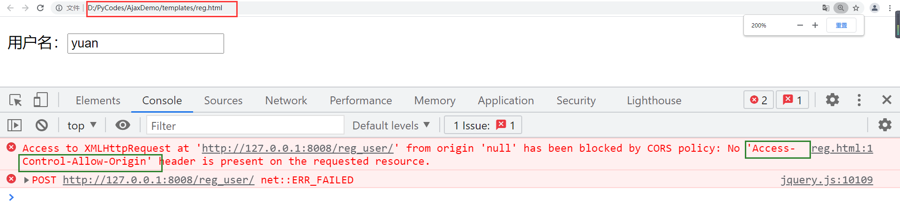

这是因为浏览器的同源策略导致的。

同源策略（Same origin policy）是一种约定，它是浏览器最核心也最基本的安全功能，如果缺少了同源策略，则浏览器的正常功能可能都会受到影响。可以说Web是构建在同源策略基础之上的，浏览器只是针对同源策略的一种实现。

> 同源策略，它是由Netscape提出的一个著名的安全策略。现在所有支持JavaScript 的浏览器都会使用这个策略。所谓同源是指，域名，协议，端口相同。当一个浏览器的两个tab页中分别打开来 百度和谷歌的页面当浏览器的百度tab页执行一个脚本的时候会检查这个脚本是属于哪个页面的，即检查是否同源，只有和百度同源的脚本才会被执行。如果非同源，那么在请求数据时，浏览器会在控制台中报一个异常，提示拒绝访问。

那么如何解决这种跨域问题呢，我们主要由三个思路：

> 1. jsonp
> 2. cors
> 3. 前端代理

这里主要给大家介绍第二个：cors

CORS需要浏览器和服务器同时支持。目前，所有浏览器都支持该功能，IE浏览器不能低于IE10。

整个CORS通信过程，都是浏览器自动完成，不需要用户参与。对于开发者来说，CORS通信与同源的AJAX通信没有差别，代码完全一样。浏览器一旦发现AJAX请求跨源，就会自动添加一些附加的头信息，有时还会多出一次附加的请求，但用户不会有感觉。

因此，实现CORS通信的关键是服务器。只要服务器实现了CORS接口，就可以跨源通信。

所以，服务器方面只要添加一个响应头，同意跨域请求，浏览器也就不再拦截：

```python 
response = JsonResponse(data)
response["Access-Control-Allow-Origin"] = "*"
```

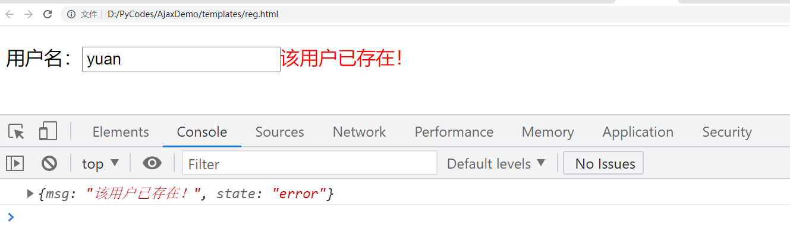

### 7.4.2、cors

cors有两种请求：简单请求和非简单请求

只要同时满足以下两大条件,就属于简单的请求

```text
（1) 请求方法是以下三种方法之一：
HEAD
GET
POST
（2）HTTP的头信息不超出以下几种字段：
Accept
Accept-Language
Content-Language
Last-Event-ID
Content-Type：只限于三个值application/x-www-form-urlencoded、multipart/form-data、text/plain
```

凡是不同时满足上面两个条件，就属于非简单请求。浏览器对这两种请求的处理，是不一样的。

简单请求:一次请求

非简单请求:两次请求，在发送数据之前会先发一次请求用于做“预检”，只有“预检”通过后才再发送一次请求用于数据传输。

```
- 请求方式：OPTIONS
- “预检”其实做检查，检查如果通过则允许传输数据，检查不通过则不再发送真正想要发送的消息
- 如何“预检”
     => 如果复杂请求是PUT等请求，则服务端需要设置允许某请求，否则“预检”不通过
        Access-Control-Request-Method
     => 如果复杂请求设置了请求头，则服务端需要设置允许某请求头，否则“预检”不通过
        Access-Control-Request-Headers
```

支持跨域,简单请求:

```text
服务器设置响应头：Access-Control-Allow-Origin = '域名' 或 '*'
```

支持跨域复杂请求:

```
由于复杂请求时，首先会发送“预检”请求，如果“预检”成功，则发送真实数据。
“预检”请求时，允许请求方式则需服务器设置响应头：Access-Control-Request-Method
“预检”请求时，允许请求头则需服务器设置响应头：Access-Control-Request-Headers
```

cors在Django中的实现：

在返回结果中加入允许信息(简单请求):

```python
def test(request):
    import json
    obj=HttpResponse(json.dumps({'name':'yuan'}))
    # obj['Access-Control-Allow-Origin']='*'
    obj['Access-Control-Allow-Origin']='http://127.0.0.1:8004'
    return obj
```

放到中间件中处理复杂和简单请求:

```python

from django.utils.deprecation import MiddlewareMixin
class MyCorsMiddle(MiddlewareMixin):
    def process_response(self, request, response):
        # 简单请求:
        # 允许http://127.0.0.1:8001域向我发请求
        # ret['Access-Control-Allow-Origin']='http://127.0.0.1:8001'
        # 允许所有人向我发请求
        response['Access-Control-Allow-Origin'] = '*'
        if request.method == 'OPTIONS':
            # 所有的头信息都允许
            response['Access-Control-Allow-Headers'] = '*'
        return response
```

在settings中配置即可,在中间件中的位置可以随意放置.

也可以通过第三方组件：pip install django-cors-headers

```python
# (1)
pip install django-cors-headers

# (2)
 INSTALLED_APPS = (
 'corsheaders',
)
  
# (3)
 1 MIDDLEWARE = [
 2     'django.middleware.security.SecurityMiddleware',
 3     'django.contrib.sessions.middleware.SessionMiddleware',
 4     'django.middleware.csrf.CsrfViewMiddleware',
 5     'django.contrib.auth.middleware.AuthenticationMiddleware',
 6     'django.contrib.messages.middleware.MessageMiddleware',
 7     'django.middleware.clickjacking.XFrameOptionsMiddleware',
 8     'corsheaders.middleware.CorsMiddleware',  # 按顺序
 9     'django.middleware.common.CommonMiddleware',  # 按顺序
10 ]
  
  # 配置白名单
 1 CORS_ALLOW_CREDENTIALS = True#允许携带cookie
 2 CORS_ORIGIN_ALLOW_ALL = True
 3 CORS_ORIGIN_WHITELIST = ( '*')#跨域增加忽略
 4 CORS_ALLOW_METHODS = ( 'DELETE', 'GET', 'OPTIONS', 'PATCH', 'POST', 'PUT', 'VIEW', )
 5 #允许的请求头
 6 CORS_ALLOW_HEADERS = (
 7     'XMLHttpRequest',
 8     'X_FILENAME',
 9     'accept-encoding',
10     'authorization',
11     'content-type',
12     'dnt',
13     'origin',
14     'user-agent',
15     'x-csrftoken',
16     'x-requested-with',
17     'Pragma',
18 )
  
```

> 前端项目设置请求头记得添加到CORS_ALLOW_HEADERS

# 八、Django的组件

## 8.1、中间件

中间件顾名思义，是介于request与response处理之间的一道处理过程，相对比较轻量级，并且在全局上改变django的输入与输出。因为改变的是全局，所以需要谨慎实用，用不好会影响到性能。

Django的中间件的定义：

```text 
Middleware is a framework of hooks into Django’s request/response processing. 
It’s a light, low-level “plugin” system for globally altering Django’s input or output.

MiddleWare，是 Django 请求/响应处理的钩子框架。
它是一个轻量级的、低级的“插件”系统，用于全局改变 Django 的输入或输出。【输入指代的就是客户端像服务端django发送数据，输出指代django根据客户端要求处理数据的结果返回给客户端】
```

如果你想修改请求，例如被传送到view中的**HttpRequest**对象。 或者你想修改view返回的**HttpResponse**对象，这些都可以通过中间件来实现。

django框架内部声明了很多的中间件，这些中间件有着各种各种的用途，有些没有被使用，有些被默认开启使用了。而被开启使用的中间件，都是在settngs.py的MIDDLEWARE中注册使用的。

Django默认的`Middleware`：

```python 
MIDDLEWARE = [
    'django.middleware.security.SecurityMiddleware',
    'django.contrib.sessions.middleware.SessionMiddleware',
    'django.middleware.common.CommonMiddleware',
    'django.middleware.csrf.CsrfViewMiddleware',
    'django.contrib.auth.middleware.AuthenticationMiddleware',
    'django.contrib.messages.middleware.MessageMiddleware',
    'django.middleware.clickjacking.XFrameOptionsMiddleware',
]
```

### 8.1.1.自定义中间件

#### （1）定义中间件

创建存放自定义中间件的文件这里选择在app01里创建mdws.py文件：

```python
from django.utils.deprecation import MiddlewareMixin


class Md1(MiddlewareMixin):

    def process_request(self, request):
        print("Md1请求")
        # return HttpResponse("Md1中断")    # 拦截

    def process_response(self, request, response):
        print("Md1返回")
        return response


class Md2(MiddlewareMixin):

    def process_request(self, request):
        print("Md2请求")
        # return HttpResponse("Md2中断")

    def process_response(self, request, response):
        print("Md2返回")
        return response

```

> 1. process_request默认返回None，返回None，则继续执行下一个中间件的process_request；一旦返回响应体对象，则会拦截返回。
> 2. process_response必须有一个形参response，并return response；这是view函数返回的响应体，像接力棒一样传承给最后的客户端。

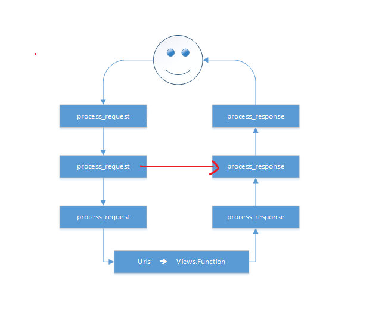

#### （2） 注册中间件

```python 
MIDDLEWARE = [
    ...
    'app01.mdws.Md1',
    'app01.mdws.Md2'
]
```

#### （3）构建index路由

```python 
# path('index/', views.index),


def index(request):
    print("index 视图函数执行...")
    return HttpResponse("hello yuan")
```

启动项目，访问index路径：


后台打印结果：

````text 
Md1请求
Md2请求
index 视图函数执行...
Md2返回
Md1返回
````

所以，通过结果我们看出中间件的执行顺序：


### 8.1.3.中间件应用

#### 1. 做IP访问频率限制

某些IP访问服务器的频率过高，进行拦截，比如限制每分钟不能超过20次。

## 8.2、Cookie与Session

我们知道HTTP协议是无状态协议，也就是说每个请求都是独立的！无法记录前一次请求的状态。但HTTP协议中可以使用Cookie来完成会话跟踪！在Web开发中，使用session来完成会话跟踪，session底层依赖Cookie技术。 

### 8.2.1、cookie

Cookie翻译成中文是小甜点，小饼干的意思。在HTTP中它表示服务器送给客户端浏览器的小甜点。其实Cookie是key-value结构，类似于一个python中的字典。随着服务器端的响应发送给客户端浏览器。然后客户端浏览器会把Cookie保存起来，当下一次再访问服务器时把Cookie再发送给服务器。 Cookie是由服务器创建，然后通过响应发送给客户端的一个键值对。客户端会保存Cookie，并会标注出Cookie的来源（哪个服务器的Cookie）。当客户端向服务器发出请求时会把所有这个服务器Cookie包含在请求中发送给服务器，这样服务器就可以识别客户端了！

> cookie可以理解为每一个浏览器针对每一个服务器创建的key-value结构的本地存储文件

#### （1）cookie流程图

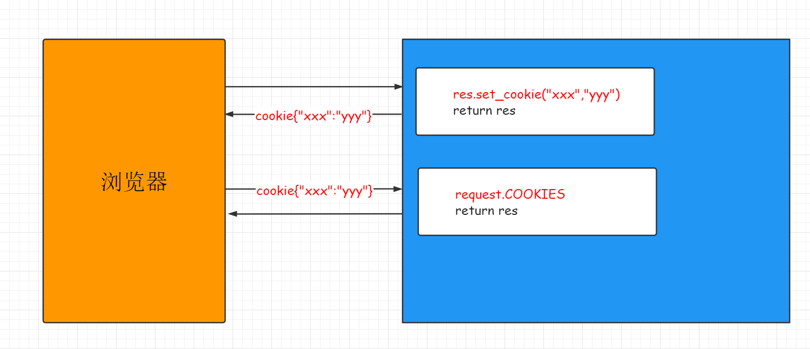

#### （2）cookie语法

```python
# (1) 设置cookie：
res = HttpResponse(...) 或 rep ＝ render(request, ...) 或 rep ＝ redirect() 
res.set_cookie(key,value,max_age...)
res.set_signed_cookie(key,value,salt='加密盐',...)　
# (2) 获取cookie：
request.COOKIES　　
# (3) 删除cookie
response.delete_cookie("cookie_key",path="/",domain=name)
```

### 8.2.2、session

> Django 提供对匿名会话(session)的完全支持。这个会话框架让你可以存储和取回每个站点访客任意数据。它在服务器端存储数据, 并以cookies的形式进行发送和接受数据。

#### （1）session流程图

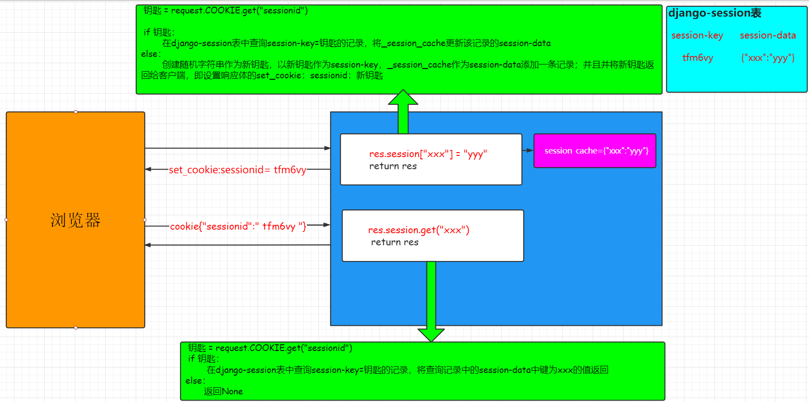

#### （2）session语法与案例

> ```python 
> # 1、设置Sessions值
>           request.session['session_name'] ="admin"
> # 2、获取Sessions值
>           session_name = request.session["session_name"]
> # 3、删除Sessions值
>           del request.session["session_name"]
> # 4、flush()
>      # 删除当前的会话数据并删除会话的Cookie。这用于确保前面的会话数据不可以再次被用户的浏览器访问
> ```

```python 

def s_login(request):
    if request.method == "GET":
        return render(request, "login.html")
    else:
        user = request.POST.get("user")
        pwd = request.POST.get("pwd")
        try:
            # user_obj = User.objects.get(user=user,pwd=pwd)
            # 写session
            # request.session["is_login"] = True
            # request.session["username"] = user_obj.user
            return redirect("/s_index/")
        except:
            return redirect("/s_login/")

          
def s_index(request):
    # 读session
    is_login = request.session.get("is_login")
    if is_login:
        username = request.session.get("username")
        return render(request, "index.html", {"user": username})
    else:
        return redirect("/s_login/")
'''
shop.html:
<p>
客户端最后一次访问时间：{{ last_time|default:"第一次访问" }}
</p>
<h3>商品页面</h3>
'''

def shop(request):
    last_time = request.session.get("last_time")
    now = datetime.datetime.now().strftime("%Y-%m-%d %X")
    request.session["last_time"] = now

    return render(request, "shop.html", {"last_time": last_time})


def s_logout(request):
    # request.session.flush()
    del request.session["username"]
    del request.session["is_login"]
    return redirect("/s_login/")

```

> 1. session 在服务器端，cookie 在客户端（浏览器）
> 2. session 默认被存在在服务器的一个文件里（不是内存）
> 3. session 的运行依赖 session id，而 session id 是存在 cookie 中的.
> 4. session 可以放在 文件、数据库、或内存中都可以。
> 5. 用户验证这种场合一般会用 session

#### （3）session配置

````python 
# Django默认支持Session，并且默认是将Session数据存储在数据库中，即：django_session 表中。
   
# 配置 settings.py
   
    SESSION_ENGINE = 'django.contrib.sessions.backends.db'   # 引擎（默认）
       
    SESSION_COOKIE_NAME ＝ "sessionid"               # Session的cookie保存在浏览器上时的key，即：sessionid＝随机字符串（默认）
    SESSION_COOKIE_PATH ＝ "/"                               # Session的cookie保存的路径（默认）
    SESSION_COOKIE_DOMAIN = None                             # Session的cookie保存的域名（默认）
    SESSION_COOKIE_SECURE = False                            # 是否Https传输cookie（默认）
    SESSION_COOKIE_HTTPONLY = True                           # 是否Session的cookie只支持http传输（默认）
    SESSION_COOKIE_AGE = 1209600                             # Session的cookie失效日期（2周）（默认）
    SESSION_EXPIRE_AT_BROWSER_CLOSE = False                  # 是否关闭浏览器使得Session过期（默认）
    SESSION_SAVE_EVERY_REQUEST = False                       # 是否每次请求都保存Session，默认修改之后才保存（默认）
````

### 8.2.3、用户认证组件

Django默认已经提供了认证系统Auth模块，我们认证的时候，会使用auth模块里面给我们提供的表。认证系统包含：

- 用户管理
- 权限
- 用户组
- 密码哈希系统
- 用户登录或内容显示的表单和视图
- 一个可插拔的后台系统 admin

#### （1）Django用户模型类

Django认证系统中提供了用户模型类User保存用户的数据，默认的User包含以下常见的基本字段：

| 字段名             | 字段描述                                                     |
| ------------------ | ------------------------------------------------------------ |
| `username`         | 必选。150个字符以内。 用户名可能包含字母数字，`_`，`@`，`+` `.` 和`-`个字符。 |
| `first_name`       | 可选（`blank=True`）。 少于等于30个字符。                    |
| `last_name`        | 可选（`blank=True`）。 少于等于30个字符。                    |
| `email`            | 可选（`blank=True`）。 邮箱地址。                            |
| `password`         | 必选。 密码的哈希加密串。 （Django 不保存原始密码）。 原始密码可以无限长而且可以包含任意字符。 |
| `groups`           | 与`Group` 之间的多对多关系。                                 |
| `user_permissions` | 与`Permission` 之间的多对多关系。                            |
| `is_staff`         | 布尔值。 设置用户是否可以访问Admin 站点。                    |
| `is_active`        | 布尔值。 指示用户的账号是否激活。 它不是用来控制用户是否能够登录，而是描述一种帐号的使用状态。 |
| `is_superuser`     | 是否是超级用户。超级用户具有所有权限。                       |
| `last_login`       | 用户最后一次登录的时间。                                     |
| `date_joined`      | 账户创建的时间。 当账号创建时，默认设置为当前的date/time。   |

上面缺少一些字段，所以后面我们会对当前内置的用户模型进行改造，比如说它里面没有手机号字段，后面我们需要加上。

#### （2）重要方法

Django 用户认证（Auth）组件需要导入 auth 模块

```python 
# 认证模块
from django.contrib import auth
# 对应数据库用户表,可以继承扩展
from django.contrib.auth.models import User
```

#### （1）用户对象

```python
create() # 创建一个普通用户，密码是明文的。
create_user() # 创建一个普通用户，密码是密文的。
create_superuser() # 与create_user() 相同，但是设置is_staff 和is_superuser 为True。

set_password(*raw_password*)
# 设置用户的密码为给定的原始字符串，并负责密码的。 不会保存User对象。当None为raw_password时，密码将设置为一个不可用的密码。
check_password(*raw_password*)
# 如果给定的raw_password是用户的真实密码，则返回True，可以在校验用户密码时使用。
```

#### （2）认证方法

```python 
auth.authenticate(username,password) 
# 将输入的密码转为密文去认证，认证成功返回用户对象，失败则返回None
```

#### （3）登录和注销方法

```python 
from django.contrib import auth
# 该函数接受一个HttpRequest对象，以及一个认证了的User对象。此函数使用django的session框架给某个已认证的用户附加上session id等信息。
auth.login() 
# 该函数接受一个HttpRequest对象，无返回值。当调用该函数时，当前请求的session信息会全部清除。该用户即使没有登录，使用该函数也不会报错。
auth.logout() 
```

#### （4）request.user

````text 
Django有一个默认中间件，叫做AuthenticationMiddleware，每次请求进来都会去session中去一个userid，取不到的话，赋值request.user = AnonymousUser() , 一个匿名用户对象。
当用户组件auth.login一旦执行，将userid到session中后，再有请求进入Django,将注册的userid对应的user对象赋值给request.user，即再后面的任何视图函数中都可以从request.user中取到该客户端的登录对象。
````

#### （5）自定义用户表

> from django.contrib.auth.models import AbstractUser
>
> 设置Auth认证模块使用的用户模型为我们自己定义的用户模型
>
> 格式：“子应用目录名.模型类名”
>
> AUTH_USER_MODEL = 'users.User'

## 8.3、Django的分页器

> ```python
> from django.core.paginator import Paginator
> ```

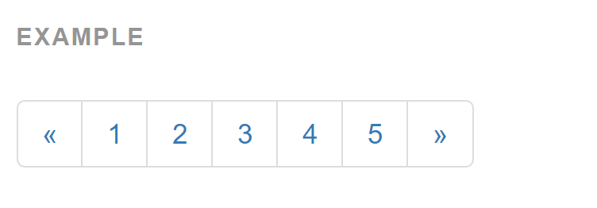

#### (1) index视图

```python 

def index(request):
    '''
    批量导入数据:

    Booklist=[]
    for i in range(100):
        Booklist.append(Book(title="book"+str(i),price=30+i*i))
    Book.objects.bulk_create(Booklist)


    分页器的使用:

    book_list=Book.objects.all()

    paginator = Paginator(book_list, 10)

    print("count:",paginator.count)           #数据总数
    print("num_pages",paginator.num_pages)    #总页数
    print("page_range",paginator.page_range)  #页码的列表


    page1=paginator.page(1) # 第1页的page对象
    for i in page1:         # 遍历第1页的所有数据对象
        print(i)

    print(page1.object_list) #第1页的所有数据


    page2=paginator.page(2)

    print(page2.has_next())            #是否有下一页
    print(page2.next_page_number())    #下一页的页码
    print(page2.has_previous())        #是否有上一页
    print(page2.previous_page_number()) #上一页的页码


    # 抛错
    #page=paginator.page(12)   # error:EmptyPage

    #page=paginator.page("z")   # error:PageNotAnInteger

    '''

    book_list = Book.objects.all()

    paginator = Paginator(book_list, 10)
    page = request.GET.get('page', 1)
    current_page = int(page)

    try:
        print(page)
        book_list = paginator.page(page)
    except PageNotAnInteger:
        book_list = paginator.page(1)
    except EmptyPage:
        book_list = paginator.page(paginator.num_pages)

    return render(request, "index.html", {"book_list": book_list, "paginator": paginator, "currentPage": current_page})

```

#### (2) index.html

```html 
<!DOCTYPE html>
<html lang="en">
<head>
    <meta charset="UTF-8">
    <title>Title</title>
    <link rel="stylesheet" href="https://cdn.bootcss.com/bootstrap/3.3.7/css/bootstrap.min.css" 
    integrity="sha384-BVYiiSIFeK1dGmJRAkycuHAHRg32OmUcww7on3RYdg4Va+PmSTsz/K68vbdEjh4u" crossorigin="anonymous">
</head>
<body>

<div class="container">

    <h4>分页器</h4>
    <ul>

        
             <li>{{ book.title }} -----{{ book.price }}</li>
        

     </ul>


    <ul class="pagination" id="pager">

                 
                    <li class="previous"><a href="/index/?page={{ book_list.previous_page_number }}">上一页</a></li>
                 
                    <li class="previous disabled"><a href="#">上一页</a></li>
                 


                 

                     
                       <li class="item active"><a href="/index/?page={{ num }}">{{ num }}</a></li>
                     
                       <li class="item"><a href="/index/?page={{ num }}">{{ num }}</a></li>

                     
                 


                 
                    <li class="next"><a href="/index/?page={{ book_list.next_page_number }}">下一页</a></li>
                 
                    <li class="next disabled"><a href="#">下一页</a></li>
                 

            </ul>
</div>


</body>
</html>
```

## 8.4、FBV与CBV

> 1 FBV ：function based view
>
> 2 BCV：class based view

### 8.4.1、前后端分离模式

在开发Web应用中，有两种应用模式：

1. 前后端不分离[客户端看到的内容和所有界面效果都是由服务端提供出来的。]


2. 前后端分离【把前端的界面效果(html，css，js分离到另一个服务端，python服务端只需要返回数据即可)】

前端形成一个独立的网站，服务端构成一个独立的网站


### 8.4.2、api接口

应用程序编程接口（Application Programming Interface，API接口），就是应用程序对外提供了一个操作数据的入口，这个入口可以是一个函数或类方法，也可以是一个url地址或者一个网络地址。当客户端调用这个入口，应用程序则会执行对应代码操作，给客户端完成相对应的功能。

当然，api接口在工作中是比较常见的开发内容，有时候，我们会调用其他人编写的api接口，有时候，我们也需要提供api接口给其他人操作。由此就会带来一个问题，api接口往往都是一个函数、类方法、或者url或其他网络地址，不断是哪一种，当api接口编写过程中，我们都要考虑一个问题就是这个接口应该怎么编写？接口怎么写的更加容易维护和清晰，这就需要大家在调用或者编写api接口的时候要有一个明确的编写规范！！！

为了在团队内部形成共识、防止个人习惯差异引起的混乱，我们都需要找到一种大家都觉得很好的接口实现规范，而且这种规范能够让后端写的接口，用途一目了然，减少客户端和服务端双方之间的合作成本。

目前市面上大部分公司开发人员使用的接口实现规范主要有：restful、RPC。

RPC（ Remote Procedure Call ）: 翻译成中文:远程过程调用[远程服务调用]. 从字面上理解就是访问/调用远程服务端提供的api接口。这种接口一般以服务或者过程式代码提供。

- 服务端提供一个**唯一的访问入口地址**：http://api.xxx.com/ 或 http://www.xx.com/api 或者基于其他协议的地址

- 客户端请求服务端的时候，所有的操作都理解为动作(action)，一般web开发时，对应的就是HTTP请求的post请求

- 通过**请求体**参数，指定要调用的接口名称和接口所需的参数

  action=get_all_student&class=301&sex=1

  m=get_all_student&sex=1&age=22

  command=100&sex=1&age=22

rpc接口多了,对应函数名和参数就多了,前端在请求api接口时难找.对于年代久远的rpc服务端的代码也容易出现重复的接口

restful: 翻译成中文: 资源状态转换.(表征性状态转移)

- 把服务端提供的所有的数据/文件都看成资源， 那么通过api接口请求数据的操作，本质上来说就是对资源的操作了.

  因此，restful中要求，我们把当前接口对外提供哪种资源进行操作，就把**资源的名称写在url地址**。

- web开发中操作资源，最常见的最通用的无非就是增删查改，所以restful要求在地址栏中声明要操作的资源是什么。然后通过**http请求动词**来说明对该资源进行哪一种操作.

  > POST http://www.xxx.com/api/students/ 添加学生数据
  >
  > GET http://www.xxx.com/api/students/ 获取所有学生
  >
  > GET http://www.xxx.com/api/students/1/ 获取id=pk的学生
  >
  > DELETE http://www.xxx.com/api/students/1/ 删除id=pk的一个学生
  >
  > PUT http://www.xxx.com/api/students/1/ 修改一个学生的全部信息 [id,name,sex,age,]
  >
  > PATCH http://www.xxx.com/api/students/1/ 修改一个学生的部分信息[age]

也就是说，我们仅需要通过url地址上的资源名称结合HTTP请求动作，就可以说明当前api接口的功能是什么了。restful是以资源为主的api接口规范，体现在地址上就是资源就是以名词表达。rpc则以动作为主的api接口规范，体现在接口名称上往往附带操作数据的动作。

### 8.4.3、RESTful API规范


REST全称是Representational State Transfer，中文意思是表述（编者注：通常译为表征）性状态转移。 它首次出现在2000年Roy Fielding的博士论文中。

RESTful是一种专门为Web 开发而定义API接口的设计风格，尤其适用于前后端分离的应用模式中。

这种风格的理念认为后端开发任务就是提供数据的，对外提供的是数据资源的访问接口，所以在定义接口时，客户端访问的URL路径就表示这种要操作的数据资源。

而对于数据资源分别使用POST、DELETE、GET、UPDATE等请求动作来表达对数据的增删查改。

| GET      | /students  | 获取所有学生       |
| :------- | :--------- | :----------------- |
| 请求方法 | 请求地址   | 后端操作           |
| POST     | /students  | 增加学生           |
| GET      | /students/ | 获取编号为pk的学生 |
| PUT      | /students/ | 修改编号为pk的学生 |
| DELETE   | /students/ | 删除编号为pk的学生 |

restful规范是一种通用的规范，不限制语言和开发框架的使用。事实上，我们可以使用任何一门语言，任何一个框架都可以实现符合restful规范的API接口。

参考文档：http://www.runoob.com/w3cnote/restful-architecture.html

接口实现过程中，会存在**幂等性**。所谓幂等性是指代**客户端发起多次同样请求时，是否对于服务端里面的资源产生不同结果**。如果**多次请求**，服务端**结果**还是**一样**，则属于**幂等接口**，如果多次请求，服务端产生结果是不一样的，则属于**非幂等接口**。

| 请求方式  | 是否幂等 | 是否安全 |
| :-------- | :------- | :------- |
| GET       | 幂等     | 安全     |
| POST      | 不幂等   | 不安全   |
| PUT/PATCH | 幂等     | 不安全   |
| DELETE    | 幂等     | 不安全   |

### 8.4.4、CBV使用

之前我们用的视图函数叫FBV（也就是函数型视图函数），这里我们来试试CBV（类视图函数）的写法。类视图函数可以让代码看起来更简洁，用起来更方便。

```python
# FBV
# def index(request):
#     if request.method == "GET":
#
#         return HttpResponse("GET")
#     elif request.method == "POST":
#
#         return HttpResponse("POST")
#
#     elif request.method == "DELETE":
#         return HttpResponse("DELETE")

# CBV模式: 基于restful开发

class IndexView(View):

    def get(self, request):
        return HttpResponse("CBV GET")

    def post(self, request):
        return HttpResponse("CBV POST")


class BookView(View):

    def get(self, request):
        # 获取数据
        book_list = Book.objects.all()

        # 序列化：json
        data_json = serializers.serialize("json", book_list)

        return HttpResponse(data_json, content_type="json")

```

```python 
# FBV模式
# path('index/', views.index),
# CBV模式
path("index/",views.IndexView.as_view()),
path("books/",views.BookView.as_view())
```

## 8.5、csrftoken（跨站请求伪造）

CSRF（Cross-Site Request Forgery，跨站点伪造请求）是一种网络攻击方式，该攻击可以在受害者毫不知情的情况下以受害者名义伪造请求发送给受攻击站点，从而在未授权的情况下执行在权限保护之下的操作，具有很大的危害性。具体来讲，可以这样理解CSRF攻击：攻击者盗用了你的身份，以你的名义发送恶意请求，对服务器来说这个请求是完全合法的，但是却完成了攻击者所期望的一个操作，比如以你的名义发送邮件、发消息，盗取你的账号，添加系统管理员，甚至于购买商品、虚拟货币转账等。

`````
-- 企业邮箱
-- pornhub.com
`````

[参考文章](https://www.pianshen.com/article/62531249043/)

token其实就是一个令牌，用于用户验证的，token的诞生离不开CSRF。正是由于上面的Cookie/Session的状态保持方式会出现CSRF，所以才有了token。

- 解除中间件注释

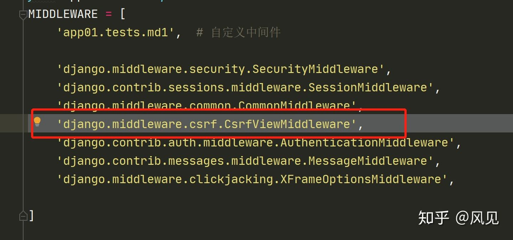

- 无csrf_token数据的post请求

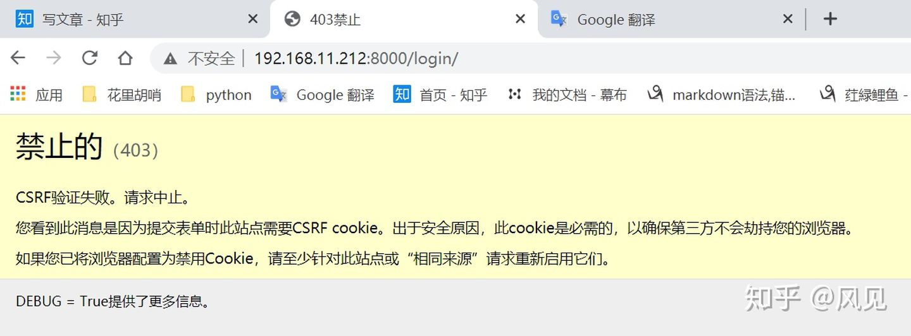

### 8.5.1、基本使用

#### 一、form表单提交

在html页面form表单中直接添加


#### 二、ajax提交

方式1：放在请求数据中。

```js
$.ajax({
  url: '/csrf_test/',
  method: 'post',
  data: {'name': $('[name="name"]').val(),
         'password': $('[name="password"]').val(),
         'csrfmiddlewaretoken':$('[name="csrfmiddlewaretoken"]').val()           
        },
  success: function (data) {
    console.log('成功了')
    console.log(data)           },
})
```

方式2：放在请求头

```js
$.ajax({
            url: '/csrf_test/',
            method: 'post',
            headers:{'X-CSRFToken':'token值'},  // 注意放到引号里面
            data:{}
}
```

### 8.5.2、全局使用，局部禁csrf

#### (1) 在视图函数上加装饰器

```python 
from django.views.decorators.csrf import csrf_exempt,csrf_protect
@csrf_exempt
def 函数名(request):  # 加上装饰器后,这个视图函数,就没有csrf校验了
```

#### (2) 视图类

```python
from django.views.decorators.csrf import csrf_exempt,csrf_protect
from django.utils.decorators import method_decorator
@method_decorator(csrf_exempt,name='dispatch')
class index(View):
    def get(self,request):
        return HttpResponse("GET")
    def post(self,request):
        return HttpResponse("POST")
```

## 8.6、ORM进阶

### 8.6.1、queryset特性

#### （1）可切片

使用Python 的切片语法来限制`查询集`记录的数目 。它等同于SQL 的`LIMIT` 和`OFFSET` 子句。

```python
>>> Article.objects.all()[:5]   # (LIMIT 5)
>>> Article.objects.all()[5:10]    # (OFFSET 5 LIMIT 5)
```

不支持负的索引（例如`Article.objects.all()[-1]`）。通常，`查询集` 的切片返回一个新的`查询集` —— 它不会执行查询。

#### （2）可迭代

```python
articleList=models.Article.objects.all()

for article in articleList:
    print(article.title)
```

#### （3）惰性查询

`查询集` 是惰性执行的 —— 创建`查询集`不会带来任何数据库的访问。你可以将过滤器保持一整天，直到`查询集` 需要求值时，Django 才会真正运行这个查询。

```python
queryResult=models.Article.objects.all() # not hits database
print(queryResult) # hits database
for article in queryResult:
    print(article.title)    # hits database
```

 一般来说，只有在“请求”`查询集` 的结果时才会到数据库中去获取它们。当你确实需要结果时，`查询集` 通过访问数据库来*求值*。 关于求值发生的准确时间。

#### （4）缓存机制

每个`查询集`都包含一个缓存来最小化对数据库的访问。理解它是如何工作的将让你编写最高效的代码。

在一个新创建的`查询集`中，缓存为空。首次对`查询集`进行求值 —— 同时发生数据库查询 ——Django 将保存查询的结果到`查询集`的缓存中并返回明确请求的结果（例如，如果正在迭代`查询集`，则返回下一个结果）。接下来对该`查询集` 的求值将重用缓存的结果。

请牢记这个缓存行为，因为对`查询集`使用不当的话，它会坑你的。例如，下面的语句创建两个`查询集`，对它们求值，然后扔掉它们：

```python
queryset = Book.objects.all()
print(queryset) # hit database
print(queryset) # hit database
```

> 注：简单地打印查询集不会填充缓存。

这意味着相同的数据库查询将执行两次，显然倍增了你的数据库负载。同时，还有可能两个结果列表并不包含相同的数据库记录，因为在两次请求期间有可能有Article被添加进来或删除掉。为了避免这个问题，只需保存`查询集`并重新使用它：

```python
queryset = Book.objects.all()
ret = [i for i in queryset] # hit database
print(queryset) # 使用缓存
print(queryset) # 使用缓存
```

何时查询集会被缓存?

> 1. 遍历queryset时
> 2. if语句（为了避免这个，可以用exists()方法来检查是否有数据）

所以单独queryset的索引或者切片都不会缓存。

```python
queryset = Book.objects.all()
one = queryset[0] # hit database
two = queryset[1] # hit database
print(one)
print(two)
```

#### （5）exists()与iterator()方法

##### exists

简单的使用if语句进行判断也会完全执行整个queryset并且把数据放入cache，虽然你并不需要这些 数据！为了避免这个，可以用exists()方法来检查是否有数据：

```python
 if queryResult.exists():
    #SELECT (1) AS "a" FROM "blog_article" LIMIT 1; args=()
        print("exists...")
```

##### iterator

当queryset非常巨大时，cache会成为问题。

处理成千上万的记录时，将它们一次装入内存是很浪费的。更糟糕的是，巨大的queryset可能会锁住系统 进程，让你的程序濒临崩溃。要避免在遍历数据的同时产生queryset cache，可以使用iterator()方法 来获取数据，处理完数据就将其丢弃。

```python
objs = Book.objects.all().iterator()
# iterator()可以一次只从数据库获取少量数据，这样可以节省内存
for obj in objs:
    print(obj.title)
#BUT,再次遍历没有打印,因为迭代器已经在上一次遍历(next)到最后一次了,没得遍历了
for obj in objs:
    print(obj.title)
```

当然，使用iterator()方法来防止生成cache，意味着遍历同一个queryset时会重复执行查询。所以使 #用iterator()的时候要当心，确保你的代码在操作一个大的queryset时没有重复执行查询。

queryset的cache是用于减少程序对数据库的查询，在通常的使用下会保证只有在需要的时候才会查询数据库。 使用exists()和iterator()方法可以优化程序对内存的使用。不过，由于它们并不会生成queryset cache，可能 会造成额外的数据库查询。　

总结:在使用缓存机制还是生成器机制的选择上如果是，数据量大情况主要使用生成器；数据少使用次数多的情况使用缓存机制。

### 8.6.2、中介模型

处理类似搭配 pizza 和 topping 这样简单的多对多关系时，使用标准的`ManyToManyField` 就可以了。但是，有时你可能需要关联数据到两个模型之间的关系上。

例如，有这样一个应用，它记录音乐家所属的音乐小组。我们可以用一个`ManyToManyField` 表示小组和成员之间的多对多关系。但是，有时你可能想知道更多成员关系的细节，比如成员是何时加入小组的。

对于这些情况，Django 允许你指定一个中介模型来定义多对多关系。 你可以将其他字段放在中介模型里面。源模型的`ManyToManyField` 字段将使用`through` 参数指向中介模型。对于上面的音乐小组的例子，代码如下：

```python
from django.db import models
 
class Person(models.Model):
    name = models.CharField(max_length=128)
 
    def __str__(self):              # __unicode__ on Python 2
        return self.name
 
class Group(models.Model):
    name = models.CharField(max_length=128)
    members = models.ManyToManyField(Person, through='Membership')
 
    def __str__(self):              # __unicode__ on Python 2
        return self.name
 
class Membership(models.Model):
    person = models.ForeignKey(Person)
    group = models.ForeignKey(Group)
    date_joined = models.DateField()
    invite_reason = models.CharField(max_length=64)
```

既然你已经设置好`ManyToManyField` 来使用中介模型（在这个例子中就是`Membership`），接下来你要开始创建多对多关系。你要做的就是创建中介模型的实例：

```python
>>> ringo = Person.objects.create(name="Ringo Starr")
>>> paul = Person.objects.create(name="Paul McCartney")
>>> beatles = Group.objects.create(name="The Beatles")
>>> m1 = Membership(person=ringo, group=beatles,
...     date_joined=date(1962, 8, 16),
...     invite_reason="Needed a new drummer.")
>>> m1.save()
>>> beatles.members.all()
[<Person: Ringo Starr>]
>>> ringo.group_set.all()
[<Group: The Beatles>]
>>> m2 = Membership.objects.create(person=paul, group=beatles,
...     date_joined=date(1960, 8, 1),
...     invite_reason="Wanted to form a band.")
>>> beatles.members.all()
[<Person: Ringo Starr>, <Person: Paul McCartney>]
```

与普通的多对多字段不同，你不能使用`add`、 `create`和赋值语句（比如，`beatles.members = [...]`）来创建关系：

```python
# THIS WILL NOT WORK
>>> beatles.members.add(john)
# NEITHER WILL THIS
>>> beatles.members.create(name="George Harrison")
# AND NEITHER WILL THIS
>>> beatles.members = [john, paul, ringo, george]
```

为什么不能这样做？ 这是因为你不能只创建 `Person`和 `Group`之间的关联关系，你还要指定 `Membership`模型中所需要的所有信息；而简单的`add`、`create` 和赋值语句是做不到这一点的。所以它们不能在使用中介模型的多对多关系中使用。此时，唯一的办法就是创建中介模型的实例。

 `remove()`方法被禁用也是出于同样的原因。但是`clear()` 方法却是可用的。它可以清空某个实例所有的多对多关系：

```python
>>> # Beatles have broken up
>>> beatles.members.clear()
>>> # Note that this deletes the intermediate model instances
>>> Membership.objects.all()
[]
```

### 8.6.3、数据库表反向生成模型类

众所周知，Django较为适合原生开发，即通过该框架搭建一个全新的项目，通过在修改models.py来创建新的数据库表。但是往往有时候，我们需要利用到之前的已经设计好的数据库，数据库中提供了设计好的多种表单。那么这时如果我们再通过models.py再来设计就会浪费很多的时间。所幸Django为我们提供了inspecdb的方法。他的作用即使根据已经存在对的mysql数据库表来反向映射结构到models.py中.

我们在展示django ORM反向生成之前，我们先说一下怎么样正向生成代码。

> 正向生成，指的是先创建model.py文件，然后通过django内置的编译器，在数据库如mysql中创建出符合model.py的表。
>
> 反向生成，指的是先在数据库中create table，然后通过django内置的编译器，生成model代码。

```python
python manage.py inspectdb > models文件名
```

### 8.6.4、查询优化

#### （1）select_related()

对于一对一字段（OneToOneField）和外键字段（ForeignKey），可以使用select_related 来对QuerySet进行优化。

select_related 返回一个`QuerySet`，当执行它的查询时它沿着外键关系查询关联的对象的数据。它会生成一个复杂的查询并引起性能的损耗，但是在以后使用外键关系时将不需要数据库查询。

简单说，在对QuerySet使用select_related()函数后，Django会获取相应外键对应的对象，从而在之后需要的时候不必再查询数据库了。

下面的例子解释了普通查询和`select_related()` 查询的区别。

查询id=2的的书籍的出版社名称,下面是一个标准的查询：

```python
# Hits the database.
book= models.Book.objects.get(nid=2)
# Hits the database again to get the related Blog object.
print(book.publish.name)
```

如果我们使用select_related()函数：

```python
books=models.Book.objects.select_related("publish").all()
for book in books:
     #  Doesn't hit the database, because book.publish
     #  has been prepopulated in the previous query.
     print(book.publish.name)
```

##### 多外键查询

这是针对publish的外键查询，如果是另外一个外键呢？让我们一起看下：

```python
book=models.Book.objects.select_related("publish").get(nid=1)
print(book.authors.all())
```

 观察logging结果，发现依然需要查询两次，所以需要改为：

```python
book=models.Book.objects.select_related("publish","").get(nid=1)
print(book.publish)
```

 或者：

```python
book=models.Article.objects
　　　　　　　　　　　　　.select_related("publish")
　　　　　　　　　　　　　.select_related("")
　　　　　　　　　　　　　.get(nid=1)  # django 1.7 支持链式操作
print(book.publish)
```

#### （2）prefetch_related()

对于多对多字段（ManyToManyField）和一对多字段，可以使用prefetch_related()来进行优化。

prefetch_related()和select_related()的设计目的很相似，都是为了减少SQL查询的数量，但是实现的方式不一样。后者是通过JOIN语句，在SQL查询内解决问题。但是对于多对多关系，使用SQL语句解决就显得有些不太明智，因为JOIN得到的表将会很长，会导致SQL语句运行时间的增加和内存占用的增加。若有n个对象，每个对象的多对多字段对应Mi条，就会生成Σ(n)Mi 行的结果表。

prefetch_related()的解决方法是，分别查询每个表，然后用Python处理他们之间的关系。

```python
# 查询所有文章关联的所有标签
books=models.Book.objects.all()
for book in books:
  	print(book.authors.all())  #4篇文章: hits database 5
```

改为prefetch_related：

```python
# 查询所有文章关联的所有标签
books=models.Book.objects.prefetch_related("authors").all()
for book in books:
  	print(book.authors.all())  #4篇文章: hits database 2
```

#### （3）extra

```python
extra(select=None, where=None, params=None, 
      tables=None, order_by=None, select_params=None)
```

有些情况下，Django的查询语法难以简单的表达复杂的 `WHERE` 子句，对于这种情况, Django 提供了 `extra()` `QuerySet`修改机制 — 它能在 `QuerySet`生成的SQL从句中注入新子句

extra可以指定一个或多个 `参数`,例如 `select`, `where` or `tables`. 这些参数都不是必须的，但是你至少要使用一个!要注意这些额外的方式对不同的数据库引擎可能存在移植性问题.(因为你在显式的书写SQL语句),除非万不得已,尽量避免这样。

##### 参数之select

The `select` 参数可以让你在 `SELECT` 从句中添加其他字段信息，它应该是一个字典，存放着属性名到 SQL 从句的映射。

```
queryResult=models.Article
　　　　　　　　　　　.objects.extra(select={'is_recent': "create_time > '2017-09-05'"})
```

结果集中每个 Entry 对象都有一个额外的属性is_recent, 它是一个布尔值，表示 Article对象的create_time 是否晚于2017-09-05.

##### 参数之`where` / `tables`

您可以使用`where`定义显式SQL `WHERE`子句 - 也许执行非显式连接。您可以使用`tables`手动将表添加到SQL `FROM`子句。

`where`和`tables`都接受字符串列表。所有`where`参数均为“与”任何其他搜索条件。

举例来讲：

```python
queryResult=models.Article
　　　　　　　　　　　.objects.extra(where=['nid in (3，4) OR title like "py%" ','nid>2'])
```

## 8.7、上传文件

### 8.7.1、form表单上传文件

```html
<h3>form表单上传文件</h3>


<form action="/upload_file/" method="post" enctype="multipart/form-data">
    <p><input type="file" name="upload_file_form"></p>
    <input type="submit">
</form>

```

```python
def index(request):
    return render(request,"index.html")

def upload_file(request):
    print("FILES:",request.FILES)
    print("POST:",request.POST)
    return HttpResponse("上传成功!")
```

### 8.7.2、Ajax(基于FormData)

FormData是什么呢？

XMLHttpRequest Level 2添加了一个新的接口`FormData`.利用`FormData对象`,我们可以通过JavaScript用一些键值对来模拟一系列表单控件,我们还可以使用XMLHttpRequest的`send()`方法来异步的提交这个"表单".比起普通的ajax,使用`FormData`的最大优点就是我们可以异步上传一个二进制文件.

所有主流浏览器的较新版本都已经支持这个对象了，比如Chrome 7+、Firefox 4+、IE 10+、Opera 12+、Safari 5+。

```html
<h3>Ajax上传文件</h3>

<p><input type="text" name="username" id="username" placeholder="username"></p>
<p><input type="file" name="upload_file_ajax" id="upload_file_ajax"></p>

<button id="upload_button">提交</button>
{#注意button标签不要用在form表单中使用#}

<script>
    $("#upload_button").click(function(){

        var username=$("#username").val();
        var upload_file=$("#upload_file_ajax")[0].files[0];

        var formData=new FormData();
        formData.append("username",username);
        formData.append("upload_file_ajax",upload_file);


        $.ajax({
            url:"/upload_file/",
            type:"POST",
            data:formData,
            contentType:false,
            processData:false,

            success:function(){
                alert("上传成功!")
            }
        });


    })
</script>

```

```python
def index(request):
  
    return render(request,"index.html")
  
  
def upload_file(request):
    print("FILES:",request.FILES)
    print("POST:",request.POST)
    return HttpResponse("上传成功!")
```

### 8.7.3、ImageField 和 FileField

ImageField 和 FileField 可以分别对图片和文件进行上传到指定的文件夹中。

1. 在下面的 models.py 中 ：

picture = models.ImageField(upload_to='avatars/', default="avatars/default.png",blank=True, null=True) 注:定义 ImageField 字段时必须制定参数 upload_to这个字段要写相对路径，

这个参数会加在 settings.py 中的 MEDIA_ROOT后面, 形成一个路径, 这个路径就是上 传图片的存放位置，默认在Django项目根路径下，也就是MEDIA_ROOT默认是Django根目录

所以要先设置好 mysite/settings.py中的 settings.py 中的 MEDIA_ROOT

```python
class Userinfo(models.Model):
    name = models.CharField(max_length=32)
    avatar_img = models.FileField("avatars/") 
```

```python
username = request.POST.get("username")
#获取文件对象
file = request.FILES.get("file")   
#插入数据，将图片对象直接赋值给字段
user = Userinfo.objects.create(name=username,avatar_img=file)
```

Django会在项目的根目录创建avatars文件夹，将上传文件下载到该文件夹中，avatar字段保存的是文件的相对路径。

2. 在 mysite/settings.py中 :

```python
MEDIA_ROOT = os.path.join(BASE_DIR,"media")
MEDIA_URL='/media/'
```

> MEDIA_ROOT:存放 media 的路径, 这个值加上 upload_to的值就是真实存放上传图片文件位置
>
> MEDIA_URL:给这个属性设值之后,静态文件的链接前面会加上这个值，如果设置这个值，则UserInfo.avatar.url自动替换成：/media/avatars/default.png，可以在模板中直接调用：。

3.url.py:

```python
from django.views.static import serve
# 添加media 配置
re_path(r'^media/(?P<path>.*)$', serve, {'document_root': settings.MEDIA_ROOT}),
```

浏览器可以直接访问http://127.0.0.1:8000/media/yuan/avatars/%E7%86%8A%E7%8C%AB.webp，即我们的用户上传文件。

最后再给大家补充一个用户文件夹路径

```python
def user_directory_path(instance, filename):
    return os.path.join(instance.name,"avatars", filename)

class Userinfo(models.Model):
    name = models.CharField(max_length=32)
    avatar_img = models.FileField(upload_to=user_directory_path)  

```

4.FileField 和 ImageFiled 相同。

### 8.7.4、导入表格批量创建数据

```python
# Create your tests here.
def multi_create(request):
    # 将接受到的excel文件转到mysql
    # （1）下载文件到服务器

    emp_excel = request.FILES.get("emp_excel")
    print(emp_excel) # 期末题目（陕西联通）.xlsx
    print(emp_excel.name) # "期末题目（陕西联通）.xlsx"
    # 下载文件
    with open("files/"+emp_excel.name,"wb") as f:

        for line in emp_excel:
            f.write(line)


    # 读取excel，批量导入到mysql中

    import os
    from openpyxl import load_workbook
    file_path = os.path.join("files",emp_excel.name)

    # 加载某一个excel文件
    wb = load_workbook(file_path)
    # 获取sheet对象
    print("wb.sheetnames",wb.sheetnames)
    worksheet = wb.worksheets[0]

    for row in worksheet.iter_rows(min_row=3):
        print(row)
        if row[0].value == None:
            break
        Employee.objects.create(name=row[0].value,
                                age=row[1].value,
                                ruzhi_date=row[2].value,
                                dep=row[3].value,
                                salary=row[4].value,
                                )


    return redirect("/index/")
```


# 九、Django3的ASGI


## 9.1、Web应用程序和web服务器

Web应用程序（Web）是一种能完成web业务逻辑，能让用户基于web浏览器访问的应用程序，它可以是一个实现http请求和响应功能的函数或者类，也可以是Django、Flask、sanic等这样的web框架，当然也可以是其他语言的web程序或web框架。

Web服务器（Web Server）是一种运行于网站后台（物理服务器）的软件。Web服务器主要用于提供网页浏览或文件下载服务，它可以向浏览器等Web客户端提供html网页文档，也可以提供其他类型的可展示文档，让客户端用户浏览；还可以提供数据文件下载等。目前世界上最主流的Web服务器有 Nginx 、Apache、IIS、tomcat。

```python
问：Web服务器和Web应用程序的区别？
答：Web应用程序主要是完成web应用的业务逻辑的处理，Web服务器则主要是应对外部请求的接收、响应和转发。
    需要使用web服务器启动运行，web应用程序才能被用户访问到。
    而django框架中，我们之所以只有一个web应用程序就跑起来了，是因为我们在终端执行了一个命令，python manage.py runserver。这个命令启动了django框架中内置提供的测试web服务器。
```

## 9.2、网关接口

网关接口（Gateway Interface，GI）就是一种为了实现加载动态脚本而运行在Web服务器和Web应用程序中的通信接口，也可以理解为一份协议/规范。只有Web服务器和Web应用程序都实现了网关接口规范以后，双方的通信才能顺利完成。常见的网关接口协议：CGI，FastCGI，WSGI，ASGI。

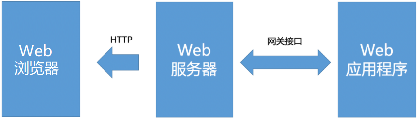

#### （1）CGI

CGI(Common Gateway Inteface): 字面意思就是通用网关接口，

> 它是外部应用程序与Web服务器之间的接口标准

意思就是它用来规定一个程序该如何与web服务器程序之间通信从而可以让这个程序跑在web服务器上。当然，CGI 只是一个很基本的协议，在现代常见的服务器结构中基本已经没有了它的身影，更多的则是它的扩展和更新。

FastCGI: CGI的一个扩展， 提升了性能，废除了 CGI fork-and-execute （来一个请求 fork 一个新进程处理，处理完再把进程 kill 掉）的工作方式，转而使用一种长生存期的方法，减少了进程消耗，提升了性能。

这里 FastCGI 就应用于前端 server（nginx）与后端 server（uWSGI）的通信中，制定规范等等，让前后端服务器可以顺利理解双方都在说什么（当然 uWSGI 本身并不用 FastCGI, 它有另外的协议）

#### （2）WSGI

WSGI（Python Web Server GateWay Interface）:它是用在 python web 框架编写的应用程序与后端服务器之间的规范（本例就是 Django 和 uWSGI 之间），让你写的应用程序可以与后端服务器顺利通信。在 WSGI 出现之前你不得不专门为某个后端服务器而写特定的 API，并且无法更换后端服务器，而 WSGI 就是一种统一规范， 所有使用 WSGI 的服务器都可以运行使用 WSGI 规范的 web 框架，反之亦然。

WSGI和ASGI，都是基于Python设计的网关接口（Gateway Interface，GI）。

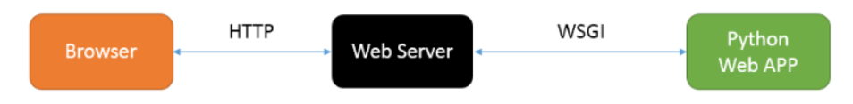

Web服务器网关接口（Python Web Server Gateway Interface，WSGI），是Python为了解决**Web服务器端与客户端之间的通信**基于CGI标准而设计的。实现了WSGI协议的web服务器有：uWSGI、uvicorn、gunicorn。像django框架一般开发中就不会使用runserver来运行，而是采用上面实现了WSGI协议的web服务器来运行。

django中运行runserver命令时，其实内部就启动了wsgiref模块作为web服务器运行的。wsgiref是python内置的一个简单地遵循了wsgi接口规范的web服务器程序。

```python
from wsgiref.simple_server import make_server
# application 由wsgi服务器调用、函数对http请求与响应的封装、使得Python专注与HTML
# environ http 请求 (dist)
# start_response 响应 (function)
def application(environ, start_response):
    # 请求
    if environ['REQUEST_METHOD'] == 'GET' and environ['PATH_INFO'] == '/':
        # 响应
        start_response('200 OK', [('Content-Type', 'text/html')])
        return [b'<h1>hi, python!</h1>']

if __name__ == '__main__':
    # 启动服务器 | 这个服务器负责与 wsgi 接口的 application 函数对接数据
    httpd = make_server('127.0.0.1', 8000, application)

    # 监听请求
    httpd.serve_forever()
    
    
# 1. 监听8000端口,
# 2. 把http请求根据WSGI协议将其转换到applcation中的environ参数, 然后调用application函数.
# 3. wsgiref会把application函数提供的响应头设置转换为http协议的响应头,
# 4. 把application的返回(return)作为响应体, 根据http协议,生成响应, 返回给浏览器.
```

开发中，我们一般使用uWSGI或者Gunicorn作为web服务器运行django。

#### （3）uWSGI

[uWSGI](https://uwsgi-docs.readthedocs.io/) 是一个快速的，自我驱动的，对开发者和系统管理员友好的应用容器服务器，用于接收前端服务器转发的动态请求并处理后发给 web 应用程序。完全由 C 编写，实现了WSGI协议,uwsgi,http等协议。注意：uwsgi 协议是一个 uWSGI服务器自有的协议,用于定义传输信息的类型，常用于uWSGI服务器与其他网络服务器的数据通信中。

uwsgi: 是uWSGI服务器实现的独有的协议， 网上没有明确的说明这个协议是用在哪里的，我个人认为它是用于前端服务器与 uwsgi 的通信规范，相当于 FastCGI的作用。


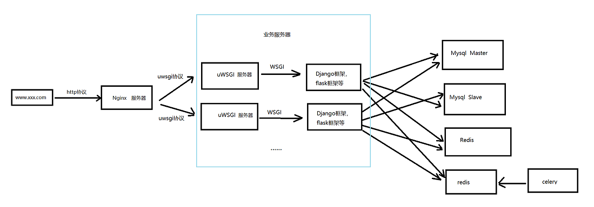

## 9.3、关于ASGI

### 9.3.1、历史趣谈

2019 年 12 月，[Django](https://so.csdn.net/so/search?from=pc_blog_highlight&q=Django)3.0 发布，它具有一个有趣的新特性——支持 ASGI 服务器。

2003 年，诸如Zope、Quixote之类的各式各样的 [Python](https://so.csdn.net/so/search?from=pc_blog_highlight&q=Python) Web 框架都附带了自己的 Web 服务器，或者拥有自己的本地接口来与流行的网络服务器（如 Apache）进行通信。

成为一名 Python Web 开发人员意味着要全身心投入到一个完整的技术栈中，但是如果需要另一个框架时，则必须重新学习所有内容。可以想象到这会导致碎片化。PEP 333，即 Python Web 服务器网关接口 v1.0，尝试通过定义一个被称为 WSGI（Web Server Gateway Interface）的简单标准接口来解决这个问题。它的卓越之处在于它的简单性。

WSGI 如此流行，以至它不仅被诸如 [Django](https://so.csdn.net/so/search?from=pc_blog_highlight&q=Django) 和 Pylons 之类的大型 Web 框架所采用，还被诸如 Bottle 之类的微框架所采用。

#### 为什么有ASGI的出现

如果我们对 WSGI 非常满意的话，为什么还要提出 ASGI 呢？如果仔细检查网络请求的整个处理流程，那么答案就非常明显了。您可以查看 在Django中网络请求如何工作 的动画。请注意，在数据库查询之后且响应发送之前，框架是如何等待的。这就是同步处理的缺点。

坦白说，直到 2009 年 Node.js 出现时，这种缺陷才变得明显或紧迫。Node.js 的创建者 Ryan Dahl 受到 C10K 问题的困扰，即为什么像 Apache 这样的流行 Web 服务器无法处理 10,000 个或更多的并发连接（给定典型的 Web 服务器硬件，内存将会耗尽）。他思考到 “查询数据库时，软件在做什么？”。

当然，答案是什么也没有发生。它正在等待数据库的响应。Ryan 认为网络服务器根本不应该去等待 I / O 活动。换言之，它应该切换为处理其他请求，并在较慢的活动完成时能得到通知。

越来越明显的是，基于异步事件的架构是解决多种并发问题的正确方法。也许这就是为什么 [Python](https://so.csdn.net/so/search?from=pc_blog_highlight&q=Python) 的创建者 Guido 亲自为 Tulip 项目提供语言级别支持的原因，这个项目后来成为了 asyncio 模块。最终，Python 3.7 添加了新的关键字 async 和 await ，用于支持异步事件循环。这不仅对如何编写 Python 代码而且对代码执行也具有重大意义。

#### Python 的两个世界

虽然使用 Python 编写异步代码非常简单，在函数定义前添加 async 关键字，但是您必须非常小心，不要打破一个重要的规则：不要随意混合使用同步代码和异步代码。

这是因为同步代码可以阻止异步代码中的事件循环。这种情况会使您的应用程序陷入停顿。正如 Andrew Goodwin 所写：这会将您的代码分为两个世界——具有不同库和调用风格的“同步代码”和“异步代码”。

回到 WSGI，这意味着我们无法编写异步可调用对象并将其嵌入。WSGI 是为同步世界编写的。我们将需要一种新的机制来调用异步代码。但是，如果每个人都编写自己的一套机制，我们将回到最初的不兼容地狱。因此，对于异步代码，我们需要一个类似于 WSGI 的新标准。因此，ASGI 诞生了。

ASGI 还有其他一些目的。但是在此之前，让我们看一下两种类似的 Web 应用程序“Hello World”，它们分别采用 WSGI 和 ASGI 风格。

与 WSGI 一样，ASGI 可调用对象可以一个接一个地链接在一起，以处理 Web 请求（以及其他协议请求），即链式调用。实际上，ASGI 是 WSGI 的超集且可以调用 WSGI 可调用对象。ASGI 还支持长时间轮询，慢速流媒体和其他响应类型，而无需侧向加载，从而可以加快响应速度。

因此，ASGI 引入了构建异步 Web 界面和处理双向协议的新方式。客户端或服务器端都无需等待对方进行通信——这可以随时异步发生。现存且以同步代码编写的基于 WSGI 的 Web 框架将不支持这种事件驱动的工作方式。

#### Django 演变

同时，想将所有这些异步优势带给 Django 面临一个重大的问题 —— 所有 Django 代码都是以同步风格编写的。如果我们需要编写任何异步代码，那么需要一个采用异步风格编写的整个 Django 框架的副本。换句话说，创建两个 Django 世界。

好吧，不要惊慌——我们可能不必编写一个完整的副本，因为有聪明的方式可以在两个世界之间重用一些代码。正如领导 Django Async 项目的安德鲁·戈德温（Andrew Godwin）正确地指出的那样，“这是 Django 历史上最大规模的修订之一”。一个雄心勃勃的项目采用异步风格重新实现 ORM、请求处理程序（request handler）、模板渲染器（Template renderer）等组件。这将分阶段进行，并在多个版本中完成。如下是安德鲁的预想（这不视为已提交的时间表）：

-  Django 3.0-ASGI 服务器
-  Django 3.1-异步视图
-  Django 3.2 / 4.0-异步 ORM

您可能正在考虑其余的组件，例如模板渲染、表单和缓存等。它们可能仍然保持同步或者其异步实现会纳入到将来的技术路线中。但是以上是 Django 在异步世界中发展的关键里程碑。

### 9.3.2、asgi的使用

ASGI，是构建于WSGI接口规范之上的**异步服务器网关接口**，是WSGI的延伸和扩展。

```
A指的是Async，异步的意思。
```

| 协议，规范 | 支持的请求协议（常见，未列全） | 同步/异步 | 支持的框架                                              |
| ---------- | ------------------------------ | --------- | ------------------------------------------------------- |
| CGI        | HTTP                           |           | CGI程序                                                 |
| WSGI       | HTTP                           | 同步      | django3.0以前，Flask1.0                                 |
| ASGI       | HTTP，HTTP2，WebSocket等       | 同步/异步 | FastAPI，Quart，Sanic，Tornado，django3.0以后，flask2.0 |

在 Python3.5 之后增加 async/await 特性之后简化了协程操作以后，异步编程变得异常火爆，越来越多开发者投入异步的怀抱。

3.0版本以前，django所提供的所有内部功能都是基于同步编程的。所以，在以往django开发中，针对网络请求，数据库读取等IO操作形成的阻塞，往往会导致项目运行性能的下降。虽然等待I/O操作数微秒时，但是随着流量的增加和操作的频率上升，这一点点的阻塞就会导致整个项目运作的缓慢。而如果换成异步就不会有任何阻塞，还可以同时处理其他任务，从而以较低的延迟处理更多的请求。所以在目前python开发中，越来越多的框架开始支持了异步编程。所以，3.0版本以后，django开始支持异步编程，可以让开发者在django中使用python第三方异步模块，推出了asgi异步web服务器。3.1版本推出了异步视图，当然，目前django的异步编程还不够完善，django中只有极少的功能是支持了异步操作。

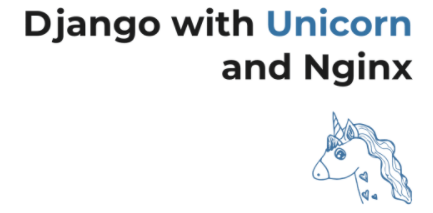

Uvicorn 是一个快速的 ASGI 服务器，Uvicorn 是基于 uvloop 和 httptools 构建的，是 Python 异步生态中重要的一员。

Uvicorn 当前支持 HTTP / 1.1 和 WebSockets，将来计划支持HTTP / 2。

文档：https://www.uvicorn.org/

安装uvicorn

```bash
pip install uvicorn
```

项目根目录下，运行django项目

```bash
# uvicorn 主应用目录名.asgi:application --reload
uvicorn homework.asgi:application --reload
```

开发中一般使用gunicorn来管理uvicorn。所以可以一并安装

 ```python
pip install gunicorn
 ```

运行

```python
# gunicorn -w 4 主应用目录名.asgi:application -k uvicorn.workers.UvicornWorker --reload
gunicorn -w 4 homework.asgi:application -k uvicorn.workers.UvicornWorker --reload
```


